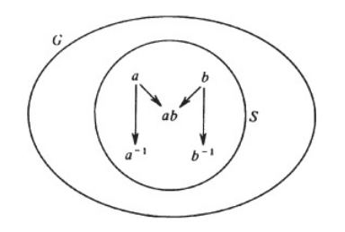
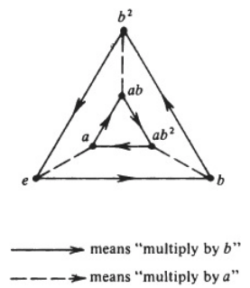
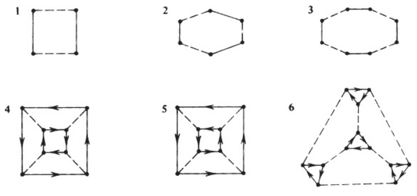

These notes are from [A Book of Abstract Algebra by Charles C. Pinter](http://www2.math.umd.edu/~jcohen/402/Pinter%20Algebra.pdf). 

```{r,echo=F, message=F}

```

# Intro. (1/3) 

## Origins

- "algebra" - _al jebr_ in Arabic was first used by Mohammed of Kharizm and roughly translated as "reunion". 

- Omar Khayyam defined algebra as the _science of solving equations_. 

- Algebra's high leve of perfection is a product of the Italian Renaissanee. 

- 1501 Girolamo Cardan, physician, astrologer, and mathematician was born. Wrote _Book on Games of Chance_ and _Ars Magna (The Great Art)_. 

- 1500 Tartaglia (Niccolo Fontana) was born. He translated Euclid and Archimedes, and in 1535 found a way of solving any cubic equation of the form $x^3+ax^2=b$.

- Ludovico Ferrari discovered the general method for solving quadratic equations of the form $x^4+ax^3+bx^2+cx=d$ around 1548. 

- 1824 Niels Abel showed _there does not exist any formula for the roots of an equation whose degree is 5 or greater_. 

## Modern Age

## The Algebra of Matrices

- A _matrix_ is a rectangular array of numbers

- $(\begin{smallmatrix} 2 & 11 & -3\\ 9 & 0.5 & 4\end{smallmatrix})$ Is a 2 X 3 matrix with two rows and three columns. 

- $(\begin{smallmatrix} a & b \\ c & d\end{smallmatrix})+(\begin{smallmatrix} a' & b' \\ c' & d'\end{smallmatrix})=(\begin{smallmatrix}a + a' & b + b'\\ c + c' & d + d'\end{smallmatrix})$

- $0 = (\begin{smallmatrix} 0 & 0 \\ 0 & 0\end{smallmatrix})$ is called the zero matrix

- $(\begin{smallmatrix} 1 & 2 \\ 3 & 0\end{smallmatrix})(\begin{smallmatrix} 1 & 1 \\ 2 & 0\end{smallmatrix})=(\begin{smallmatrix}5 & 1\\ 3 & 3\end{smallmatrix})$

  - $(1\times1)+(1\times2)=5$
  
  - $(1\times1)+(1\times0)=1$
  
  - $(3\times0)+(1\times2)=3$
  
  - $(3\times0)+(1\times0)=3$

- For matrices the commutative law of multiplication $AB=BA$ is not true. 

- $I = (\begin{smallmatrix} 1 & 0 \\ 0 & 1\end{smallmatrix})$ is called the _identity_ matrix. 

## Boolean Algebra

- $A\cup B=A+B$

- $A\cap B=A\cdot B$

- axioms are followed

## Algebraic Structures

- an algebraic structure is one with an arbitrary set, with one ore more defined operations. 

- algebra is the study of algebraic structures 

## Axioms

- first appears in Euclid's _Elements_

- Premises : 

  - things that are equal to the same thing are equal to each other
  
  - The whole is greater than the part
  
  - A straight line can be drawn through any two points. 
  
  - All right angles are equal 
  
- what was important about Euclid was the way he organized geometric facts into a logical sequence where each theorem builds on preceding theorems and then forms the logical basis for other theorems. 

- Axiomatic method is not a way of discoving facts but organizing them 

- lucid perfection and flawless simplicity 

- note that mathematics is essentially abstract, so we acquire knowledge about them by logic and not observation 

## The Axiomatics of Algebra

We assume that _A_ is any set and there is anoperation on _A_ which we designater with the symbol *. 

(1) $a*b=b*a$ : communtative 

(2) $a*(b*c)=(a*b)*c$ : associative

(3) $e*a=a$ and $a*e=a$ $\forall a\in A$ : identity element

(4) $a*a^{-1}=e$ and $a^{-1}*a=e$ : every element has an inverse 

(5) $a*(b\perp c)=(a*b)\perp(a*c)$ : * is distributive over $\perp$

Note : a ring is a set _A_ with two operations, usually symbolized by + and $\cdot$; having the following axioms: _Addition is commutative and associative, it has a neutral element commonly symbolized by 0, and every element a has an inverse –a with respect to addition. Multiplication is associative, has a neutral element 1, and is distributive over addition._

- matrix algebra is an example of a ring

## Abstraction Revisted

- The process of selecting what is relevant and disregarding everything elese is the very essence of abstraction. 

- Abstraction in modern algebra began about 1830's and was completed about 100 years later. 

- Evariste Galoris (born ~ 1812) tied problems of finding the roots of equations with new discovereies on permutations, but was overlooked (and forgotten) by Cauchy, Fourier, and Poisson. His papers weren't published until 10 years after he died. 


# Ch. 2 : Operations (1/5)

An operation * on A is a rule which assigns to each ordered pair (a,b) of elements of A exactly one element of a*b in A.

There are three aspects of this definition which need to be stressed: 

(1) a*b is defined $\forall$ oredered pair (a,b) of elements of A

- For example, division does not qualify as an operation on the set of $\mathbb{R}$ the real numbers, for there are ordered pairs such as (3,0) whose quotient 3/0 is undefined. In order to be an operation on $\mathbb{R}$, division would have to associate a real number alb with every ordered pair (a, b) of elements of $\mathbb{R}$.

(2) a*b must be uniquely defined.

(3) If a and b are in A, a*b must be in A

- "A is closed under the operation *"

An operations is a way of combining two elements, so associiative law is important when considering 3 or more elements

# Ch. 3 : The Definition of Groups (1/7)

A group is a set with a defined operation that is associative, has a neutral element, and for which each element has an inverse. This group can be represented $<G,*>$.

$<\mathbb{Z},+>$ : additive group of integers. 

$<\mathbb{Q},+>$ : additive group of rational numbers.

$<\mathbb{R},+>$ : additive group of the reals.

$<\mathbb{Q^*},\cdot>$ : multiplicative group of non zero rational numbers.

$<\mathbb{R^*},\cdot>$ : multiplicative group of non zero real numbers.

$\mathbb{Q}^{\text{pos}}$ denoters the group of all positive rational numbers. 

$\mathbb{R}^{\text{pos}}$ denoters the group of all positive real numbers. 

Finite groups have a limited number of elements. 

_A groups of integers modulo n_ (where n is any positive integer greate than 1) is the easiest finite group to study. 

- modulo n consists of {0,1,2,...,n-1}. 

- Ex : modulo 6 is {0,1,2,3,4,5}.

- it may be useful to use operation tables 

- Commutative is not true in every group 

# Ch. 4 : Elementary Properties of Groups (1/12)

Every group has exactly one idently element. 

Each element in every group has exactly one inverse. 

"plus" : additive notation. 

"multiply" : multiplicative notation. 

Groups with be "G" or "H".

e is the identity element. 

"a inverse" : $a^{-1}$.

> **Theorem 1** : If G is a group and a, b, c are elements of G then 
>
> (i) $ab=ac\quad\Rightarrow b=c$ and 
>
> (ii) $ba=ca\quad \Rightarrow b=c$

Proof : Suppose   
\begin{equation}\label{proof T.1}
\begin{split}
ab & = ac\quad\text{ Then, } \\
a^{-1}(ab) & = a^{-1}(ac)\quad\text{ By the associative law,} \\
(a^{-1}a)b & = (a^{-1}a)c \\
eb & = ec \\
b & = c
\end{split}
\end{equation}

> **Theorem 2** : If G is a group and a, b are elements of G, then
> $$ab=e\quad\Rightarrow\quad a=b^{-1}\quad\text{ and }\quad b=a^{-1}$$

Proof : If $ab=e$, then $ab=aa^{-1}$ so by the cancellation law, $b=a^{-1}$. Analogously, $a=b^{-1}$. 

Meaning that if the product of two elements is e, then those elements are inverses of each other. (If a is inverse of b, then b is inverse of a.)

> **Theorem 3** : If G is a group and a, b are elements of G, then 
>
> (i) $a^{-1}b^{-1}=b^{-1}a^{-1}$
>
> (ii) $(a^{-1})^{-1}=a$

Meaning (i) the inverse of a product is the product of the inverse, and (ii) that a is the inverse of the inverse of a.  

Proof (i) : 
\begin{equation}\label{proof T.3(i)}
\begin{split}
(ab)(b^{-1}a^{-1}) & = a[(bb^{-1})a^{-1}] \\
& = a[ea^{-1}] \\
& = aa^{-1} \\
& = e
\end{split}
\end{equation}

Since the product ab and $b^{-1}a^{-1}$ is equal to e, it follows by T.2 that they are each others inverses. Thus, $(ab)^{-1}=b^{-1}a^{-1}$. 

Proof (ii) : $aa^{-1}=e$ , so by T.2 a is the inverse of $a^{-1}$, that is $a=(a^{-1})^{-1}$. 

If G is a finite group, the number of elements in G is called the _order_ of G. It is customary to denote the order of G by the symbol |G|. 

# Ch. 5 : Subgroups (1/14)

Let G be a group, and S a nonempty subset of G. 

If the product of every pair of elements of S is in S then we say that S is _closed with respect to multiplication_. 

IF the inverse of every element of S is in S then we say S is _closed with respect to inverses_.

If S is closed with respect to multiplication and inverese then we call S a _subgroup_ of G. 

 

If the operation of G is denoted by "+" then, 

If the sum of every pair of elements is in S, we say that S is _closed with respect to addition_. 

If the negative of every element of S is in S, we say that S is closed with _respect to negatives_. 

If both these things happen then S is a subgroup of G. 

Examples : 

- The set of all even integers is a subgroup of the additive group $\mathbb{Z}$ of the integers. 

- $\mathbb{Q}^*$ (nonzero rational numbers under multiplication) is a subgroup of $\mathbb{R}^*$ (nonzero real numbers under multiplication). 

  - $\mathbb{Q^*}\subseteq\mathbb{R^*}$
  
Important Note : If S is a subgroup of G then S has the same operation as G. 

If G is a group and S is a sub-group of G, then S is a group. 

$\mathscr{F}\mathbb{(R)}$ represents the set of all functions from $\mathbb{R}$ to $\mathbb{R}$. 

$\mathscr{C}(\mathbb{R})$ represents the set of all _continuous_ functions from $\mathbb{R}$ to $\mathbb{R}$.

- $\mathscr{C}(\mathbb{R})$ is a subgroup of $\mathscr{F}\mathbb{(R)}$

$\mathscr{D}\mathbb{(R)}$ represents the set of all _differentiable_ functions from $\mathbb{R}$ to $\mathbb{R}$.

- $\mathscr{D}(\mathbb{R})$ is a subgroup of $\mathscr{F}\mathbb{(R)}$

Trivial Subgroups: 

- $\{e\}$ is the one-element subset containing only the neutral element is a subgroup. 

- The whole group of G is a subgroup of itself. 

All other subgrous of G are called _proper subgroups_. 

$<a>$ meaning $a_1,...,a_n$ is called a _cyclic subgroup_ of G. 

- a is called its generator 

- $<a>$ consists of all possible products of a and $a^{-1}$. (similalar with sums)

If a group G is generated by a single elemnt a, we call G a _cyclic group_. 

- $\mathbb{Z}_6$ is cyclic 

A set of equations, involving only the generators and their inverses, is called a set of _defining equations_ for G if these equations completely determine the multiplication of G. 

A group determined by a set of generators and defining equations, can be represented in a diagram called a _Cayley diagram_. (see below)





# Ch. 6 : Functions (1/21)

Pages 60 - 65

# Ch. 7 : Groups of Permutations (1/24)

# Ch. 8 : Permutations of a Finite Set (1/26)

# Ch. 9 : Isomorphism (1/31)

# Ch. 10 : Order of Group Elements (2/4)

# Ch. 11 : Cyclic Groups (2/7)

# Ch. 12 : Paritions and Equivalence Relations (2/16)

# Ch. 13 : Counting Cosets (2/18)

# Ch. 14 : Homomorphisms (2/23)

# Ch. 15 : Quotitent Groups (2/28)

# Ch. 16 : The Fundamental Homomorphism Theorem (3/4)
