```{r,echo=F, message=F}

```

# W7D18: Feb. 14th, 2022

## **Ch. 11 Cyclic Groups** 

The $\underline{\text{cyclic group generated by a }}$ is $\langle a\rangle =\{...,a^{-2},a^{-1},e,a,a^2,...\}$. 

If ord$(a)=n<\infty$ (this means $a^n=e$ and none of $a,a^2,a^3,...,a^{n-1}$ equal e), then $\langle a\rangle=\{e,a,a^2,...,a^{n-1}\}$. 

### Theorem 1:

(a) Every cyclic group of size $n<\infty$ is isomorphic to $\mathbb{Z}_n$.

(b) Every infinite cyclic group is isomorphic to $\mathbb{Z}$. 

Proof: 

(a) Let $G=\langle a\rangle =\{e,a,a^2,...,a^{n-1}\}$ be a cyclic group. 

This function $f:G\rightarrow \mathbb{Z}_n$ defined by $f(a^i)=i$ is an isomorphism. 

(b) The same function works here. 

### Theorem 2: 

Every subgroup of a cyclic group is cyclic. 

Proof: 

Let $G=\langle a\rangle$ be cyclic. Let H be a subgroup of G. If $H=\{e\}$, then $H=\langle e\rangle$ is cyclic. So assume $H\ne \{e\}$. 

$\underline{\text{Claim}}$: H is generated by $a^m$, where m is the least positive exponent appearing in H. 

We'll show $H=\langle a^m\rangle$ by showing $\langle a^m\rangle \subseteq H$ and $H\subseteq\langle a^m\rangle$. 

Take any element $g\in \langle a^m\rangle$. Then $g=(a^m)^k$ for some $k\in \mathbb{Z}$. Since $a^m\in H$, any power of $a^m$ is in H (since H is a subgroup). Hence, $g=(a^m)^k\in H$, proving $\langle a\rangle\subseteq H$. 

Now we'll show $H\subseteq\langle a^m\rangle$. Take any $h\in H$. Then $h=a^t$ for some $t\in\mathbb{Z}$. 

By the Division Algorithm $\exists$ $g,r\in\mathbb{Z}$ s.t. $$\frac{t}{m}=q+\frac{r}{m}\quad\quad\text{and}\quad\quad0\leq\frac{r}{m}\leq 1$$

$$\Rightarrow t=mq+r\quad\quad\text{and}\quad\quad0\leq r\leq m$$

$$\Rightarrow h=a^t=a^{mq+r}=(a^m)^qa^r\quad\quad\quad$$

Now solve for $a^r$: 

$$h=(a^m)^qa^r\quad\Rightarrow \quad a^r=(a^m)^{-q}h$$

($a^m$ is in H, and so is h)

$\Rightarrow a^r\in H$

We chose $a^m$ to be the element of H with the least positive exponent. We just showed that $a^r\in H$. Since $0\leq r<m$, it must be the case that $r=0$. 

Hence, $h=a^t=a^{mq}=(a^m)^q\in \langle a\rangle$, implying $H\subseteq\langle a\rangle$. 

Putting this all together, $H=\langle a\rangle$ is cyclic. 

### Ex. List all subgroups of $\mathbb{Z}_6$

List all subgroups of $\mathbb{Z}_6=\{0,1,2,3,4,5\}$: 

1. $\langle 0\rangle =\{0\}$

2. $\langle 1\rangle =\mathbb{Z}_6$

3. $\langle 2\rangle =\{0,2,4\}$

4. $\langle 3\rangle =\{0,3\}$

5. $\langle 4\rangle =\{0,2,4\}$

6. $\langle 5\rangle =\mathbb{Z}_6$

### Facts about cyclic groups:

Let $G=\langle a\rangle=\{e,a,a^2,a^3,...,a^{n-1}\}$ be a cyclic group of size n. 

1. G is abelian (Since $a^ia^j=a^{i+j}=a^{j}a^{i}$)

2. Let $k\geq 1$ be a positive divisor of $|G|=n$. Then G has exactly one subgroup of size k. 

3. The subgroup of G of size 1 is $\langle e\rangle =\{e\}$. If $k>1$ is a divisro of n, the subgorup of size k is $\langle a^{n/k}\rangle$

### Ex. List subgroups of $G_{12}$

Let $G=\langle a\rangle=\{e,a,a^2,a^3,...,a^{n-1}\}$ be a cyclic group of size 12. List the subgroups of G 


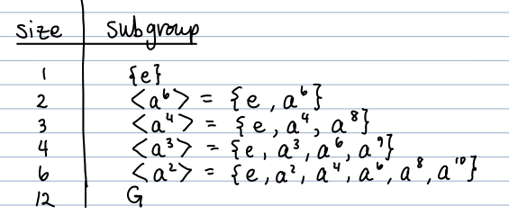

### Theorem: Size and Order of Cyclic groups

A group of size n is cyclic if and only if it has an element of order n. 

$\underline{\text{Proof}}$ ($\Rightarrow$) let $G=\langle a\rangle$ be a cyclic group of size n. The generator, a, must have order n. 

($\Leftarrow$) let G be a group of size n. let $b\in G$ have order n. 

Then the elements $e,b,b^2,b^3,...,b^{n-1}$ are distinct. Since all elements are in G and $|G|=n$, it must be the case that $G=\{e,b,b^2,...,b^{n-1}\}$, i.e. G is cyclic. $\square$

### Ex. Show $\mathbb{Z}_2\times\mathbb{Z}_3\cong\mathbb{Z}_6$

By theorem 1, we just need to show that $\mathbb{Z}_2\times\mathbb{Z}_3$ is cyclic. By theorem above, we just need to show $\mathbb{Z}_2\times\mathbb{Z}_3$ has an element of order 6. 

I claim that $(1,1)\in\mathbb{Z}_2\times\mathbb{Z}_3$ has order 6. 

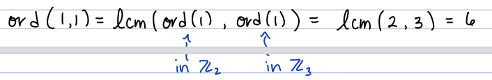

"how many 1's do you need to add to get zero in the first group? (2) in the second group? (3), then the lcm of 2 and 3 is 6."

Hence $\mathbb{Z}_2\times\mathbb{Z}_3=\langle (1,1)\rangle$ is cyclic, proving $\mathbb{Z}_2\times\mathbb{Z}_3\cong \mathbb{Z}_6$. 

### Ex. $\mathbb{Z}_2\times\mathbb{Z}_4\ncong\mathbb{Z}_8$? 

Let's see that $(1,1)\in\mathbb{Z}_2\times\mathbb{Z}_4$ doesn't have order 8: 

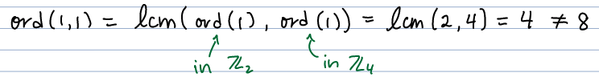

Thus, $\langle (1,1)\rangle$ has only 4 elements, not 8. 

### Th. Greatest Common Divisor

$\mathbb{Z}_m\times\mathbb{Z}_n\cong \mathbb{Z}_{mn}$ if and only if the greatest common divisor of m and n is 1. 

### Ex. What other elements of cyclic group size 8 (G) are generators of G

Let $G=\langle a\rangle=\{e,a,a^2,a^3,...,a^7\}$ be a cyclic group of size 8. What other elements of G are generators of G?

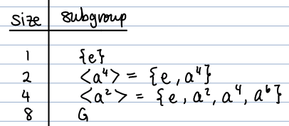

Fact: The other generators of G are $a^3$, $a^5$, and $a^7$. This is because their greatest common divisor with 8 is 1. 

# W7D19: Feb. 16th, 2022

## **Ch.11 Cyclic Groups** 

On Monday we showed: 

1. A group of size $n<\infty$ is cyclic (and therefore isomorphic to $\mathbb{Z}_n$) if and only if it has an element of order n. 

2. Every subgroup of a cyclic group is cyclic. If G is a cyclic group of size n, G has exactly one subgroup of size k for each positive divisor k of n. The subgroup of size k is generated by an element of order k. 

### Ex. $A_3\cong\mathbb{Z}_3$

Recall $A_3$ is the group of even permutations in $S_3$: $$A_3=\{\epsilon , (123), (132)\}.$$ 

"only even permutations so switching one element with another wont work. Only "forward" 1 - 2 - 3 and "backwards" 1 - 3 - 2."

Show $A_3\cong \mathbb{Z}_3$. We just need to find an element in $A_3$ with order 3. Since the order of a cycle is equal to its length, ord((123))=$\epsilon$. So, $$A_3=\langle (123)\rangle\quad\quad\Rightarrow\quad\quad A_3\cong \mathbb{Z}_3$$

### Ex. List the subgroups of $A_3$

There will be exactly one subgroup of size k for each positive divisor k of 3. Since the positive divisors of 3 are 1 and 3, the only subgroups of $A_3$ are 

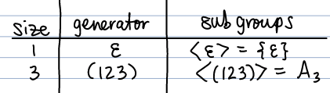

(one question like this on homework 4)

Note: it doesn't matter where you start, because 312 represents the same cyclic group as 123. 

## **Ch.12 Partitions and Equivalence Relations** 

Let A be a nonempty set. A $\underline{\text{partition}}$ of A is a collection of nonempty subsets of A $$\{A_i|i\in I\}$$ such that 

(i) distinct subsets $A_i$ and $A_j$ don't overlap (i.e. [for a proof show] if $A_i$ and $A_j$ have an element in common, then $A_i=A_j$. "the only way these two overlap is if they are the same to begin with")

(ii) $\underset{i\in I}U$ (i.e. every element of A is in one of the subsets $A_i$)

(think of little "i's" as labels)

Example: think of coins in a jar. Pennies and nickles wont overlap but they are all still in the jar. (check the book)

### Ex. Partitions of $\mathbb{Z}$

1. $\{2\mathbb{Z},2\mathbb{Z}+1\}$ (even integers, odd integers)

2. $\{3\mathbb{Z},3\mathbb{Z}+1,3\mathbb{Z}+2\}$

$\quad\quad\quad 3\mathbb{Z}=\{...,-6,-3,0,3,6,9,...\}$

$\quad\quad\quad 3\mathbb{Z}+1=\{...,-5,-2,1,4,7,10,...\}$

$\quad\quad\quad 3\mathbb{Z}+2=\{...,-4,-1,2,5,8,11,...\}$

3. $\{A_0,A_1\}$, where 

$\quad\quad\quad A_0=\{n\in\mathbb{Z}|n\text{ is prime}\}=\{2,3,4,7,11\}$

$\quad\quad\quad A_1=\{n\in\mathbb{Z}|\text{ n isn't prime}\}$

### Ex. Partitions the elements of $S_3=\{\epsilon, (12), (13), (23), (123), (132)\}$

$\{A_3,A_3(12)\}$ (even permutations, odd permutations)

where $A_3=\{\epsilon, (123), (132)\}$

$A_3(12)=\{\epsilon(12),(123)(12), (132)(12)\}=\{(12),(13),(23)\}$

"stick a (12) on the right"

A (binary) $\underline{\text{relation}}$ on a set A is a statement that is either true or false for each pair $(x,y)\in A\times A$. 

### Ex "$x<y$" is a relation on $\mathbb{Z}$

This is true for $(2,5)$ since $2<5$, but is false for $(10,-6)$ since $10\nless -6$. 

### Ex "x=y" is a relation on $\mathbb{Z}$

This is true for $(3,3)$ since $3=3$, but false for $(1,7)$ since $1\ne 7$.

### Equivalence relation: $\sim$

This textbook uses the sumbol $\sim$ to denote a relation on A that satisfies the following: 

1. Reflexively: For all $a\in A$, $a\sim a$. (Would say that A is relexive if "a is equivalent to itself".)

2. Symmetry: If $a\sim b$, then $b\sim a$. 

3. Transitivity: If $a\sim b$ and $b\sim c$, then $a\sim c$.

A relation $\sim$ that satisfies these 3 properties is called an $\underline{\text{equivalence relation}}$. If $a\sim b$, we say "a is equivalent to b."

### Ex. "="

The relation = is an equivalence relation on $\mathbb{Z}$. 

### Ex. "<"

The relation < is $\underline{\text{not}}$ an equivalence relation since its not reflexive or symmetric. ($a\nless a$ and, for example, $1<2$ but $2\nless 1$.)

### Equivalence class

Let $\sim$ be an equivalence relation on A. The $\underline{\text{equivalence class}}$ of $a\in A$ is the set $$[a]=\{x\in A|x\sim a\}$$ 

note: a is the set of all elements that are equivalent to a. 

### Ex. Define $\sim$ on $\mathbb{Z}$ by $a\sim b$ if and only if $a-b$ is a multiple of 3. 

For example, $7\sim 4$ since $7-4=3$. Similarly, $7\sim -8$ since $7-(-8)=15=3\cdot 5$. 

Let's show $\sim$ is an equivalence relation. 

1. For all $a\in\mathbb{Z}$, $a\sim a$ because $a-a=0=3\cdot 0$. 

2. Suppose that $a\sim b$. Then $a-b=3n$ for some $n\in\mathbb{Z}$ multiplying by -1 gives $$b-a=-3n=3(-n)\quad\Rightarrow b\sim a$$

3. Suppose that $a\sim b$ and $b\sim c$. Then $a-b=3n$ and $b-c=3m$ for some $m,n\in\mathbb{Z}$. Adding these equations (b's will cancel) gives $$a-c=3n+3m=3(n+m)\quad\quad\Rightarrow a\sim c.$$

So $\sim$ is an equivalence relation on $\mathbb{Z}$. List the equivalnece classes. 

\begin{equation}\label{D19.0}
\begin{split}
[0] &= \{a\in\mathbb{Z}|a\sim 0\}\\
&= \{a\in\mathbb{Z}|a-0\text{ is a multiple of 3}\}\\
&= \{...,-6, -3, 0, 3, 6, 9,...\}
\end{split}
\end{equation}

\begin{equation}\label{D19.1}
\begin{split}
[1] &= \{a\in\mathbb{Z}|a\sim 1\}\\
&= \{a\in\mathbb{Z}|a-1\text{ is a multiple of 3}\}\\
&= \{a\in\mathbb{Z}|a\text{ is a multiple of 3 plus 1}\}\\
&= \{...,-5, -2, 1, 4, 7, 10,...\}
\end{split}
\end{equation}

\begin{equation}\label{D19.2}
\begin{split}
[2] &= \{a\in\mathbb{Z}|a\sim 2\}\\
&= \{a\in\mathbb{Z}|a-2\text{ is a multiple of 3}\}\\
&= \{...,-4, -1, 2, 5, 8, 11,...\}
\end{split}
\end{equation}

"the list for [2] can be taken from [1], but add two"

So, $\{[0],[1],[2]\}$ is a partition of $\mathbb{Z}$. (It's the same as the example $\{3\mathbb{Z}, 3\mathbb{Z}+1,3\mathbb{Z}+2\}$ from earlier.)

Note: Mathematicians don't like to say "sets of sets", so say "collection of sets instead". 

Note: [3] = [0], and [1] = [4], and so on

# W7D20: Feb. 18th, 2022

## **Ch 12 Partitions and Equivalence Relations:**

Let A be a nonemepty set.

A $\underline{\text{partition}}$ of A is a collection $\{A_i|i\in I\}$ of nonempty subsets of A such that 

(i) distinct subsets don't overlap

(ii) every element of A is in one of the subsets $A_i$

A relation $\sim$ on A is an $\underline{\text{equivalence relation}}$ if 

(i) $a\sim a$ for all $a\in A$

(ii) If $a\sim b$ then $b\sim a$ for all $a,b\in A$

(iii) If $a\sim b$ and $b\sim c$, then $a\sim c$. 

For all $a\in A$, the $\underline{\text{equivalence class of a}}$ is the set of $x\in A$ such that $x\sim a$: $$[a]=\{x\in A|x\sim a\}.$$

### Facts

1. The set of all equivalence classes $\{[a]|a\in A\}$ forms a partition of A. 

2. Suppose $\{A_i|i\in I\}$ is a partition of A. Define $\sim$ on A by $$a\sim b\text{ iff a and b are in the same subset }A_i$$ This is an equivalence relation on A. 

### Ex. Check equivalence relation

Let G be a group and H a subgroup of G. Define $\sim$ on G by $$a\sim b\text{ iff }ab^{-1}\in H.$$

This is an equivalence relation on G. 

(i) $a\sim a$ because $aa^{-1}=e\in H$

(ii) Suppose $a\sim b$. Then $ab^{-1}\in H$. Since H is closed under inverses, $$(ab^{-1})^{-1}=(b^{-1})^{-1}a^{-1}=ba^{-1}\in H\quad\Rightarrow b\sim a$$

(iii) Suppose $a\sim b$ and $b\sim c$. Then $ab^{-1}$ and $bc^{-1}$ are in H. Since H is closed under the operation, $ab^{-1}bc^{-1}=ac^{-1}\in H\quad\Rightarrow a\sim c.$

What is the equivalence class of $a\in G$? 

\begin{equation}\label{D20.1}
\begin{split}
[a] &= \{x\in G|x\sim a\}\\
&= \{x\in G|xa^{-1}\in H\}\\
&= \{x\in G|xa^{-1}=h\text{ for some }h\in H\}\\
&= \{x\in G|x=ha\text{ for some }h\in H\}
\end{split}
\end{equation}

## **Ch. 13 - Counting Cosets**

Let G be a group and H a subgroup of G. For any $a\in G$, the set $$Ha=\{ha|h\in H\}$$ is called a (right) $\underline{\text{coset}}$ of H in G. 

The set $aH=\{ah|h\in H\}$ is a left coset. 

If the operation is +, the right coset looks like $H+a=\{h+a|h\in H\}$. 

### Ex. List the cosets of $H=3\mathbb{Z}$ in $G=\mathbb{Z}$

Let $G=\mathbb{Z}$ and $H=3\mathbb{Z}=\{...,-3,0,3,6,9,... \}$. 

List the cosets of H in G: 

$\quad\quad\quad H+0=H=\{...,-3,0,3,6,9,... \}$

$\quad\quad\quad H+1=\{...,-2,1,4,7,10,... \}$

$\quad\quad\quad H+2=\{...,-1,2,5,8,11,... \}$

$\quad\quad\quad H+3=H$

$\quad\quad\quad H+4=H+1$

### Ex. List the cosets of $H=\langle 5\rangle$ in $G=\mathbb{Z}_{15}$

Let $G=\mathbb{Z}_{15}$ and $H=\langle 5\rangle=\{0,5,10\}$. List the cosets of H in G:

$\quad\quad\quad H+0=H=\{0,5,10\}$

$\quad\quad\quad H+1=\{1,6,11\}$

$\quad\quad\quad H+2=\{2,7,12\}$

$\quad\quad\quad H+3=\{3, 8, 13\}$

$\quad\quad\quad H+4=\{4,9,14\}$

Since all elements of G have been listed at this point, these are all the cosets. 

### Ex. List the cosets of $H=\langle (12)\rangle$ in $G=S_3$

Let $G=S_3=\{\mathcal{E}, (12), (13), (23), (123),(132)\}$ and $H=\langle (12)\rangle=\{\mathcal{E}, (12),\}$. List the cosets of H in G: 

$\quad\quad\quad H\mathcal{E}=\{\mathcal{E}\mathcal{E},(12)\mathcal{E}\}=\{\mathcal{E},(12)\}$

$\quad\quad\quad H(13)=\{\mathcal{E}(13),(12)(13)\}=\{(13),(132)\}$

$\quad\quad\quad H(23)=\{\mathcal{E}(23),(12)(23)\}=\{(23),(123)\}$

### Facts about Cosets

(can use these facts on the last problem for homework 4, will prove next week)

1. All cosets have the same size as H. 

2. Distinct cosets don't overlap. 

3. Every element of G is in some coset of H. 

$\quad\quad$ Proof: Let $a\in G$. Since $e\in H$, $a=ea\in Ha$.

4. How should we choose a so that we don't get repeated cosets? Choose a to be an element of G that hasn't yet appeared in a coset. 

$\quad\quad$ Why? If a and b are in the same coset, then $Ha=Hb$. (Ex. If two basketball players play for the same team)

5. How do we know when we've listed all cosets? We're done when every element of G has appeared in a coset. 

### Ex. Cosets

Let $G=\mathbb{R}\times\mathbb{R}=\{(x,y)|x,y\in\mathbb{R}\}$. Let $H=\{(x,y)\in G|y=x\}$. 

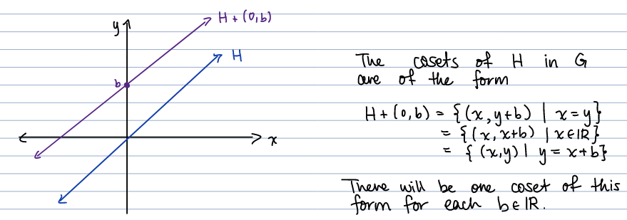

### Ex. How many cosets of H are in G? 

Let $G=\mathbb{Z}_3\times\mathbb{Z}_3$ and $H=\langle (1,1)\rangle =\{(0,0), (1,1), (2,2)\}$. 

How many cosets of H in G are there? There are $\frac{|G|}{|H|}=\frac{9}{3}=3$.

$\quad\quad\quad H+(0,0)=H=\{(0,0), (1,1), (2,2)\}$

$\quad\quad\quad H+(1,0)=H=\{(1,0), (2,1), (0,2)\}$

$\quad\quad\quad H+(2,0)=H=\{(2,0), (0,1), (1,2)\}$

Note: this is really $\mathbb{Z}_3$ in disguise. 

# <span style="color: deepskyblue;">W8D21: Feb. 21st, 2022</span> 

## Ch. 13 Counting Cosets 

Let H be a subgroup of a group G. For $a\in G$, the set $$Ha=\{ha|h\in H\}$$ is called a (right) $\underline{\text{coset}}$ of H in G. 

### Ex. Let $G=\mathbb{Z}_{12}$ and $H=\langle 6\rangle =\{0,6\}$. 

There are 6 cosets:

$\quad H+0=H=\{0,6\}$

$\quad H+1=\{1,7\}$

$\quad H+2=\{2,8\}$

$\quad H+3=\{3,9\}$

$\quad H+4=\{4,10\}$

$\quad H+5=\{5,11\}$

### Lemma: Distinct cosets don't overlap.

$\underline{\text{Proof}}$:

Suppose cosets Ha and Hb both contain an element x. We'll show that Ha=Hb. 

Let's show that $Ha\subseteq Hb$. 

Since $x\in Ha$, $x=h_1a$ for some $h_1\in H$. Similarly, since $x\in Hb$, $x=h_2b$ for some $h_2\in H$. 

Let's solve $x=h_1a$ for a: 

\begin{equation}\label{D21a}
\begin{split}
x=h_1a &\Rightarrow h_1^{-1}x=h_1^{-1}a\\
&\Rightarrow a=h_1^{-1}x
\end{split}
\end{equation}

Now take any $h_3a\in Ha$. We'll show that $h_3a\in Hb$:

\begin{equation}\label{D21b}
\begin{split}
h_3a &= h_3h_1^{-1}x\quad\text{ , since }a=h_1^{-1}x\\
&= h_3h_1^{-1}h_2b\quad\text{ , since }x=h_2b
\end{split}
\end{equation}

Since H is a subgroup, $h_3h_1^{-1}h_2\in H$. Hence $h_3a=h_3h_1^{-1}h_2b\in Hb$. We've shown every element of Ha is in Hb. thus, $Ha\subseteq Hb$. 

The proof that $Hb\subseteq Ha$ is very similar. 

So, if Ha and Hb have an element in common, then $Ha=Hb$. 

$\square$

### Corollary: If $a\in Hb$ then $Ha=Hb$

$\underline{\text{Proof}}$:

Since $e\in H$, $a=ea\in Ha$. if $a\in Hb$ as well, then $$a\in Ha\cap Hb.$$ Hence, by the lemma above $Ha=Hb$. 

### Theorem 1

The set $\{Ha|a\in G\}$ of all cosets of H in g is a partition of G. 

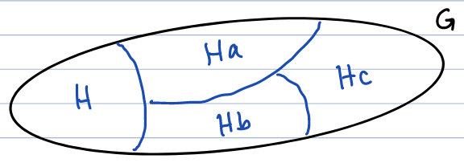

$\underline{\text{Proof}}$:

By the lemma, distinct cosets don't overlap. Moreover, every $a\in G$ is in a coset, since $a\in Ha$. Thus, $\{Ha|a\in G\}$ is a partition of G. 

### Corollary

Define a relation $\sim$ on G by $a\sim b$ iff a and b are in the same coset of H. 

This defines an equivalence relation on G. 

### Theorem 2

Every coset of H in G has the same size as H. 

$\underline{\text{Proof}}$:

Let Ha be a coset of H in G. Define $f:H\rightarrow Ha$ by $$f(h)=ha.$$

We'll show f is a bijection. 

First suppose $f(x_1)=f(x_2)$. Then, by definition, $x_1a=x_2a$. By right cancellation, $x_1=x_2$. So f is one-to-one. 

Now take any $ha\in Ha$. Then $h\in H$ and $f(h)=ha$, proving that f is onto. 

Since f: $H\rightarrow Ha$ is a bijection, $|H|=|Ha|$. $\quad\square$

### Lagrange's Theorem 

Let G be a finite group and H a subgroup of G. Then the size of H divides the size of G. 

$\underline{\text{Proof}}$:

By Theorems 1 and 2, the set of all cosets of H partitions G into subsets of the same size. 

Let n be the number of cosets of H. Then $$|G|=n\cdot |H|$$

where n is the number of cosets, and $|H|$ is the size of each coset. 

$\Rightarrow\frac{|G|}{|H|}=n\in \mathbb{N}$

$\Rightarrow$ divides $|G|$. 

The number of cosets of H in G, n,  is called the $\underline{\text{index}}$ of H in G and is denoted (G:H). 

### Theorem 4

Let $p\in\mathbb{Z}$ be prime. (So $p\in\{2,3,5,7,11,13,...\}$) If $|G|=p$, then $G\cong\mathbb{Z}_p$. 

$\underline{\text{Proof}}$:

Let $|G|=p$. Let $a\in G$ be such that $a\ne e$. Let $H=\langle a\rangle$. Since $a\ne e$, $|H|>1$. By Lagrange's Theorem $|H|$ must divide the prime p. Therefore, it must be the case that $|H|=p$. 

Hence, $G=H=\langle a\rangle$ is cyclic. So, by Theorem 1 from Ch. 11, $$G\cong\mathbb{Z}_p.$$ $\quad\square$

### Theorem 5

Let G be a finite group and $a\in G$. Then ord(a) divides $|G|$. 

$\underline{\text{Proof}}$:

Let $H=\langle a\rangle$. Then $|H|=$ ord(a). By Lagrange's Theorem, $|H|$ divides $|G|$. Hence, ord(a) divides |G|. $\quad\square$

### Proposition 

Let $G=\{e,a,b,c\}$ be a group of size 4. Then $G\cong \mathbb{Z}_4$. 

So, let's suppose G doesn't have an element of order 4. Then by Theorem 5, every nonidentity element of G has order 2. Therefore, $$a^2=b^2=c^3=e.$$

There is only one way to fill out the operation table: (we saw in chapter 4)

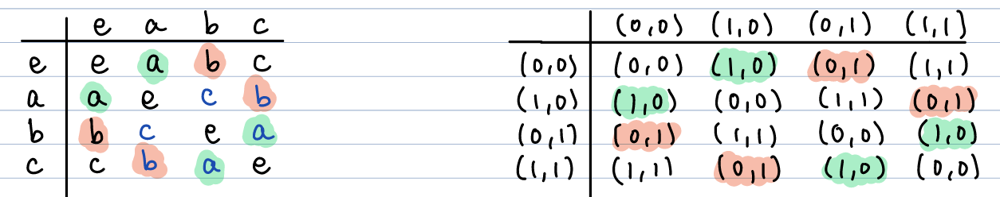

- will do more multiplication tables in chapter 15

- keep identities in the same place 

- (bc of cyclic group) indentity goes down the diagnol 

The function $f:G\rightarrow\mathbb{Z}_2\times\mathbb{Z}_2$ given by 

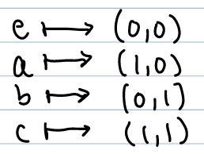

is an isomorphism. 

### Ex. Adding to Friday's example 

Let $G=S_3=\{\epsilon, (12), (13), (23),(123), (132)\}$ and $H=\langle (12)\rangle=\{\epsilon ,,(12)\}$. List the cosets of H in G: 

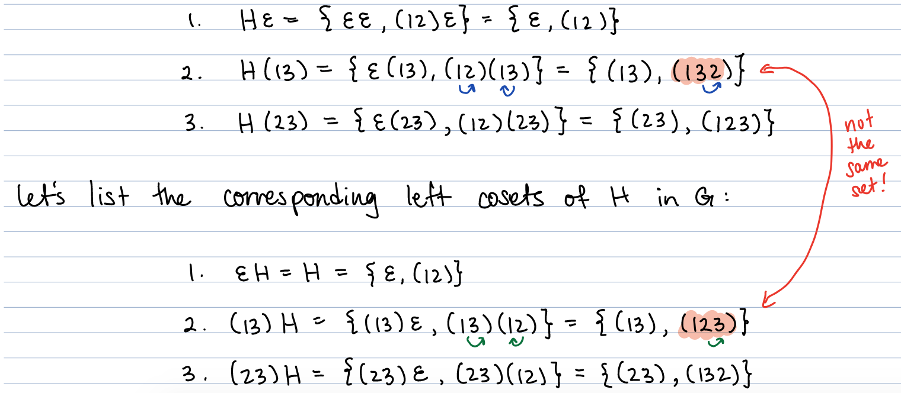

# <span style="color: deepskyblue;">W8D22: Feb. 23rd, 2022</span> 

## Ch. 14 - Homomorphisms and Normal Subgroups 

Let $G_1$ and $G_2$ be groups. A $\underline{\text{homomorphsim}}$ is a function $f:G_1\rightarrow G_2$ such that for all a,b $\in G_1$, 

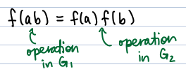

If $f:G_1\rightarrow G_2$ is an onto homomorphsim, we call $G_2$ a $\underline{\text{homomorphic image}}$ of $G_1$. 

### Ex. Define $f:\mathbb{Z}\times\mathbb{Z}\rightarrow\mathbb{Z}$ by $f(x,y)=x+y$.

For example, $f(1,5)=1+5=6$ and $f(-3,9)=-3+9=6$. This implies f is not injective (one-to-one). 

Let's show that f is onto. Take any $y\in\mathbb{Z}$. Then $(0,y)\in\mathbb{Z}\times\mathbb{Z}$ and $$f(0,y)=0+y=y.$$

Hence, f is onto. 

Now let's show f is a homomorphism: 

\begin{equation}\label{D22.1}
\begin{split}
f((a_1,a_2)+(b_1,b_2))&=f(a_1+b_1,a_2+b_2)\\
&= a_1+b_1+a_2+b_2\\
&= a_1+a_2+b_1+b_2\\
&= f(a_1,a_2)+f(b_1,b_2)
\end{split}
\end{equation}

### Def. Kernel

Let $f:G_1\rightarrow G_2$ be a homomorphsim. The $\underline{\text{kernel}}$ of f is the set of all elements in $G_1$ that get sent to $e_2\in G_2$: $$\text{ker}(f)=\{x\in G_1|f(x)=e_2\}.$$

### Ex. Find kern of (f)

let $f:\mathbb{Z}\times\mathbb{Z}\rightarrow\mathbb{Z}$ be defined $f(x,y)=x+y$. 

\begin{equation}\label{D22.2}
\begin{split}
\text{kern}(f) &= \{(x,y)\in\mathbb{Z}\times\mathbb{Z}|f(x,y)=0\}\\
&= \{(x,y)\in\mathbb{Z}\times\mathbb{Z}|x+y=0\}\\
&= \{(x,y)\in\mathbb{Z}\times\mathbb{Z}|y=-x\}\\
&= \{...(-1,1),(0,0),(1,-1), (2,-2),(3,-3,...)\}
\end{split}
\end{equation}

Note: "In linear algebra you talked about the null space, and that's what this is."

### Theorem 1:

Let $f:G_1\rightarrow G_2$ be a homomorphism. Then 

(i) $f(e_1)=e_2$

(ii) $f(a^{-1})=[f(a)]^{-1}\forall a\in G_1$

$\underline{\text{Proof}}$: Same as in Ch. 9

### Theorem 

Let $f:G_1\rightarrow G_2$ be a homomorphism. Then f is one-to-one if and only if ker(f)=$\{e_1\}$.

$\underline{\text{Proof}}$: 

($\Rightarrow$) Assume that f is one-to-one. Let $x\in$ ker(f). Then, by definition and Theorem 1(i), $$f(x)=e_2=f(e_1).$$

Since f is one-to-one, this implies that $x=e_1$. Hence, ker(f)=$\{e_1\}$. 

($\Leftarrow$) Now assume that ker(f)=$\{e_1\}$. We'll show f is one-to-one. Let $x_1,x_2\in G_1$ be such that $f(x_1)=f(x_2)$: 

\begin{equation}\label{D22.3}
\begin{split}
f(x_1)=f(x_1) &\Rightarrow f(x_1)[f(x_2)]^{-1}=f(x_2)[f(x_2)]^{-1}\\
&\Rightarrow f(x_1)f(x_2^{-1})=e_2\quad\text{ by Theorem 1(ii)}\\
&\Rightarrow f(x_1x_2^{-1})=e_2\\
&\Rightarrow x_1x_2^{-1}\in\text{ker}(f)\\
&\Rightarrow x_1x_2^{-1}=e_1\quad\text{, since ker}(f)=\{e_1\}\\
&\Rightarrow x_1x_2^{-1}x_2 = e_1x_2\\
&\Rightarrow x_1=x_2
\end{split}
\end{equation}

hence, f is one-to-one. $\quad\quad\square$

(this might be helpful for the HW4 Q4a)

### Def. Conjugate

let G be a group and $g_1x\in G$. The element $gxg^{-1}$ is called the $\underline{\text{conjugate}}$ of x by g. 

Going from x to $gxg^{-1}$ is called $\underline{\text{conjugation by g}}$.

Let H be a subgroup of G. We call H a $\underline{\text{normal}}$ subgroup of G if all $g\in G$ and $h\in H$, the conjugate $$ghg^{-1}$$ is in H. Notation: $H \unlhd G$

### Theorem: Abelian subgroups are normal 

If G is abelian, every subgroup of G is normal. 

$\underline{\text{Proof}}$: Let g be abelian and H a subgroup of G. Then for all $g\in G$ and $h\in H$, $$ghg^{-1}=gg^{-1}h=h\in H.$$

Hence, $H\unlhd G$. $\quad\quad\square$

### Ex Show H is not $\underline{\text{not}}$ a normal subgroup of G. 

Let $h=(12)$ and $g=(23)$. Then 

\begin{equation}\label{D22.4}
\begin{split}
ghg^{-1} &= (23)(12)(23)^{-1}\\
&= (23)(12)(32)\\
&= (13)
\end{split}
\end{equation}

Since $ghg^{-1}=(13)\notin H$, H is not a normal subgroup of $S_3$. 

### Ex. Show that H is normal in $G_1\times G_2$. 

Let $G_1$ and $G_2$ be groups and let $$H=\{(x_1e_2)|x\in G_1\}\subseteq G_1\times G_2.$$

Show that H is normal in $G_1\times G_2$. 

Let $g(g_1,g_2)\in G_1\times G_2$ and $(h,e_2)\in H$. Then 

\begin{equation}\label{D22.5}
\begin{split}
(g_1,g_2)(h_1e_2)(g_1,g_2)^{-1} &= (g_1,g_2)(h_1e_2)(g_1^{-1},g_2^{-1})\\
&= (g_1hg_1^{-1},g_2e_2g_2^{-1})\\
&= (g_1hg_1^{-1}, g)2g_2^{-1}\\
&= (g_1hg_1^{-1},e_2)\\
&\in H.
\end{split}
\end{equation}

### Theorem: Normal subgroup

Let H be a subgroup of G. Then H is normal in G if and only if $aH=Ha$ for all $a\in G$. 

"Every left coset is the same as every right coset"

$\underline{\text{Proof}}$: On Friday. 

### Ex. Show that the subgroup H is normal in $S_3$

Let $g=S_3=\{\mathcal{E}, (12), (13),(23),(123),(132)\}$. show that the subgroup $H=\langle (123)\rangle =\{\mathcal{E},(123),(132)\}$ is normal in $S_3$. 

List the right cosets of H in G: 

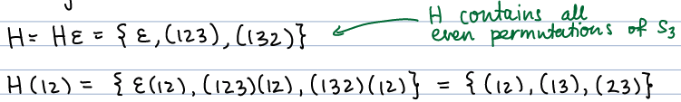

List the corresponding left cosets:

$\quad\quad H=\mathcal{E}H=\{\mathcal{E},(123),(132)\}$

$\quad\quad (12)H=\{(12)\mathcal{E},(12)(123),(12)(132)\}=\{(12),(23),(13)\}$

Since $aH=Ha$ for all $a\in S_3$, H is a normal subgroup of $S_3$. 

# <span style="color: deepskyblue;">W8D23: Feb. 25th, 2022</span> 

## Ch. 14 Homomorphisms and Normal Subgroups 

A $\underline{\text{homomorphism}}$ is a function $f:G_1\rightarrow G_2$ such that for all $a,b\in G_1$ $$f(ab)=f(a)f(b)$$

(doesn't need to be one-to-one or onto)

The $\underline{\text{kernel}}$ of homorphism $f:G_1\rightarrow G_2$ is the set $$ker(f)=\{x\in G_1|f(x)=e_2\}.$$

(everything in the first group that is the identity in second group)

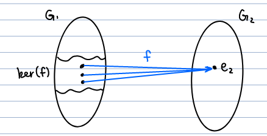

### Def. Normal Subgroup

A subgroup H of G is called a $\underline{\text{normal subgroup}}$ if for all $g\in G$ and $h\in H$. $$ghg^{-1}\in H.$$

### Theorem 

A subgroup H of G is normal in G iff $aH=Ha\forall a\in G$. 

$\underline{\text{Proof}}$: ($\Rightarrow$) Assume $\unlhd$. To show $aH=Ha$, we need to show $aH\subseteq Ha$ and $Ha\subseteq aH$. 

Let's show $aH\subseteq Ha$. take any $aH\in aH$. since $H\unlhd G$, $aha^{-1}\in H$. So, $aha^{-1}=h$, for some $h_1\in H$. Therefore, $$ah=aha^{-1}a=h_1a\in Ha.$$

We showed any element $ah\in aH$ is also an element of $Ha$. So, $aH\subseteq Ha$. 

The proof that $Ha\subset aH$ is similar. 

$(\Leftarrow)$ Assume $aH=Ha$ for all $a\in G$. Take any $g\in G$ and $h\in H$. Since $gh\in gH$ and $Hg$, $gh\in Hg$. This means $gh=h_1g$ for some $h_1\in H$. Thus, $$gh=h_1g\quad\Rightarrow\quad ghg^{-1}=h_1gg^{-1}=h_1\in H.$$

So, by definition, $H \unlhd G$. 

### Ex. Show H is normal in $D_4$

Let $G=D_4=\{1,r,r^2,r^3,s,sr,sr^2,sr^3\}$ and $H=\langle r^2\rangle=\{1,r^2\}$. We'll show H is normal in $D_4$ by comparing left and right cosets. 

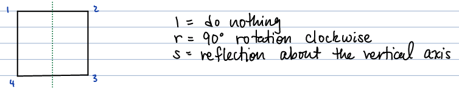

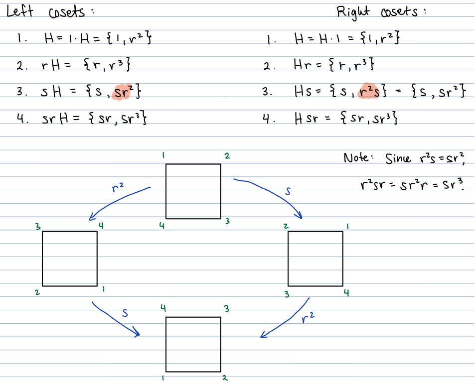

(The number of cosets if equal to G/H:8/2=4)

(When you get to 4. it is everything in G that hasn't been filled out yet.)

(Bottom order is reverse for s and $r^2$ in four square image (3.))

### Example (Homomorphsism: Linear Algebra)

Let $G=\{(\begin{smallmatrix}a & b \\ c & d\\\end{smallmatrix})|\text{a,b,c,d}\in\mathbb{R}\text{ and }ad-bc=0\}$ with matrix multiplication. 

Define $f:G\rightarrow\mathbb{R}^*$ by $f(A)=det(A)$. This is a homomorphism: $$f(AB)=det(AB)=det(A)det(B)=f(A)f(B).$$

\begin{equation}\label{D23.1}
\begin{split}
ker(f)&=\{A\in G|f(A)=1\}\\
&= \{A\in G|f(A)=1\}
\end{split}
\end{equation}

### Example (Homomorphsim)

Define $f:\mathbb{R}^*\rightarrow\mathbb{R}^+$ by $f(x)=|x|$. This is a homomorphism: $$f(ab)=|ab|=|a||b|=f(a)f(b).$$

\begin{equation}\label{D23.2}
\begin{split}
ker(f)&=\{x\in \mathbb{R}^*|f(x)=1\}\\
&= \{-1,1\}
\end{split}
\end{equation}

### Theorem 2

Let $f:G_1\rightarrow G_2$ be a homomorphism. 

(a) ran(f)=$\{f(x)|x\in G_1\}$ is a subgroup of $G_2$

(b) ker(f) is a normal subgroup of $G_1$.

(In fact, every normal subgroup is ther kernel of some homomorphsim.) 

$\underline{\text{Proof}}$: 

(b) Take any $g\in G$ and $h\in$ker(f). We want to show $ghg^{-1}\in$ker(f):

\begin{equation}\label{D23.3}
\begin{split}
f(ghg^{-1}) &= f(g)f(h)f(g^{-1})\\
&= f(g)e_2f(g^{-1})\quad\quad\text{ since }h\in\text{ker(f)}\\
&= f(g)f(g^{-1})\\
&= e_2\quad\quad\quad\quad\text{ since f(g) and }f(g^{-1})\text{ are inverses}
\end{split}
\end{equation}

$\Rightarrow ghg^{-1}\in$ker$(f)$.

# W9D24: Feb. 28th, 2022

## Ch. 14 Homomorphisms and Normal subgroups 

The $\underline{\text{kernel}}$ of homomorphism $f:G_1\rightarrow G_2$ is the set $$\text{ker}(f)=\{x\in G_1 |f(x)=e_2\}$$

Note: Ker$(f)$ always contains $e_1$ since $f(e_1)=e_2$

A subgroup H of G is called $\underline{\text{normal}}$ in G if one of the following equivalent conditions holds:

(i) For all $g\in G$ and $h\in H$, $ghg^{-1}\in H$. 

(ii) For all $a\in G$, $aH=Ha$.

Note: every subgroup of an abelian group is normal 

### Theorem 2 (i)

Let $f:G_1\rightarrow G_2$ be a homomorphsim. Then ker(f) is a normal subgroup of $G_1$. 

$\underline{\text{Proof}}$: We showed that ker$(f)$ is closed under conjugates and contains $e_1$. 

Let's show that ker(f) is closed under the operation and inverses. 

Let $a,b\in$ker$(f)$. We'll show $a,b\in$ker$(f)$ and $a^{-1}\in$ker$(f)$. $$f(ab)=f(a)f(b)=e_2e_2=e_2\quad\quad\Rightarrow\quad\quad ab\in\text{ker}(f)$$ and $$f(a^{-1})=[f(a)]^{-1}e_2^{-1}=e_2\quad\quad\Rightarrow\quad\quad a^{-1}\in\text{ker}(f)$$

Hence, ker$(f)$ is a normal subgroup of $G_1$. $\quad\quad\square$

## Ch. 15 Quotient Groups

### Def. Coset (Right)

Let H be a subgroup of G. For any $a\in G$, the set $$Ha=\{ha|h\in H\}$$

is called a (right) $\underline{\text{coset}}$ of H in G. 

### Def. Coset multiplication or addition

In this chapter we'll define a group whose elements are the cosets of H in G. What's the operation? $$Ha\cdot Hb=H(ab)$$ or $$(H+a)+(H+b)=H+(a+b)$$

This is called $\underline{\text{coset multiplication}}$

### Ex. Adding Cosets

(These next two examples are from homework 4)

Consider the cosets of $H=\langle 4\rangle=\{0,4,8\}$ in $\mathbb{Z}_{12}$. 

\begin{equation}\label{D24.1}
\begin{split}
H+0 &= H = \{0,4,8\}=H+4=H+8\\
H+1 &= \{1,5,9\}=H+5=H+9\\
H+2 &= \{2,6,10\}=H+6=H+10\\
H+3 &= \{3,7,11\}=H+7=H+11
\end{split}
\end{equation}

Note: If $a\in H+b$, then $H+a=H+b$. 

Let's add the last two cosets a few different ways:

$\quad\quad(H+2)+(H+3)=H+(2+3)=H+5$

$\quad\quad(H+6)+(H+7)=H+(6+7)=H+1$

(Note: $H+5=H+1$)

The choice of representatives for the cosets didn't affect the output of the coset addition. This is because H is **normal** in $\mathbb{Z}_{12}$. 

### Ex. Multiply Cosets

Now consider the cosets of $H=\{\mathcal{E},(23)\}$ in $S_3$. 

\begin{equation}\label{D24.2}
\begin{split}
H\mathcal{E} &= H = \{\mathcal{E},(23)\}=\{(23)\}\\
H(12) &= \{(12),(132)\}=H(132)\\
H(13) &= \{(13),(123)\}=H(123)
\end{split}
\end{equation}

Let's multiply the last two cosets: 

$\quad\quad H(12)\cdot H(13)=H(12)(13)=H(132)$

$\quad\quad H(132)=H(132)(123)=H\mathcal{E}=H$

(Note: $H(132)\ne H$)

What went wrong in this example? The subgroup H isn't normal in $S_3$. Coset multiplication / addition is only an operation if the subgroup H is normal in G. 

### Theorem 2

Let H be a normal subgroup of G. If $Ha=Hc$ and $Hb=Hd$, then $H(ab)=H(cd)$.

$\underline{\text{Proof}}$ 

To prove $H(ab)=H(cd)$, we need to show $ab\in H(cd)$.

Since $a\in Ha$ and $Ha=Hc$, $a\in Hc$. So $a=h_1c$ for some $h_1\in H$. Similarly, $b\in Hb=Hd$, which implies $b=h_2d$ for some $h_2\in H$. Therefore,

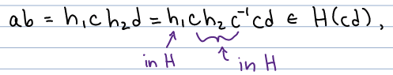 

(We want to end with an equation with "stuff from H" ($h_1ch_2c^{-1}$) on the left and "cd"  on the right)

($ch_2c^{-1}$ is a conjugate, which is in H)

since H is a normal subgroup and is, hence, clsoed underconjugates. 

We're shown $ab\in H(cd)$. Thus $H(ab)=H(cd)$. 

### Theorem 3 (Quotient Group)

Let H be a normal subgroup of G. The set $$G/H=\{Ha|a\in G\}$$

(read "G mod H", which is something we've heard before. However this is a special case.)

togetehr with coset multiplication is a group, called the $\underline{\text{quotient group}}$ of G by H. 

$\underline{\text{Proof}}$:

The identity element in $G/H$ is $H=He$:

\begin{equation}\label{D24.3}
\begin{split}
Ha\cdot He&=H(ae)=Ha\\
He\cdot Ha&=H(ea)=Ha
\end{split}
\end{equation}

The inverse of a coset Ha is $Ha^{-1}$

\begin{equation}\label{D24.4}
\begin{split}
Ha\cdot Ha^{-1} &=H(aa^{-1})=He\\
Ha^{-1}\cdot Ha &= H(a^{-1}a)=He
\end{split}
\end{equation}

(e is the identity in G/H)

See the book for the proof that coset multiplication is associative. $\quad\quad\square$

### Ex. List the elements of $\mathbb{Z}_6/\langle 3\rangle$

(Note: $\langle 3\rangle=\{0,3\}$)

\begin{equation}\label{D24.5}
\begin{split}
\langle 3\rangle &= \{0,3\}\\
\langle 3\rangle +1 &= \{1,4\}\\
\langle 3\rangle +2 &= \{2,5\}
\end{split}
\end{equation}

(Note: this quotient group is isomorphic to $\mathbb{Z}_3$)

### Ex. List elements $G/H$

Let $G=\mathbb{Z}_2\times\mathbb{Z}_4$ and $H=\langle (0,2)\rangle=\{(0,0),(0,2)\}$. List the elements of $G/H$. 

\begin{equation}\label{D24.6}
\begin{split}
H+(0,0) &= \{(0,0),(0,2)\}\\
H+(1,0) &= \{(1,0),(1,2)\}\\
H+(0,1) &= \{(0,1),(0,3)\}\\
H+(1,1) &= \{(1,1),(1,3)\}
\end{split}
\end{equation}

Note: this quotient group is isomorphic to $\mathbb{Z}_2\times\mathbb{Z}_2$. 

Lets compute a few inverses in $G/H$. 

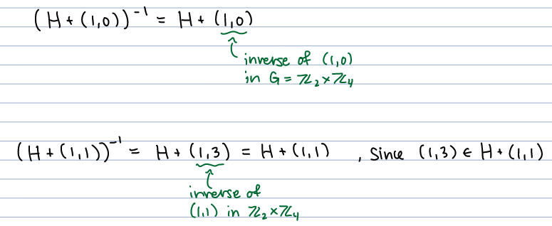

(it takes one one to get to zero in mod 2, and 3 in mod 4.)

# W9D25: Mar. 2nd, 2022

## Ch. 15 Quotient Groups Cont. 

Let H be a normal subgroup of G. The $\underline{\text{quotient group}}$, denoted $G/H$, is the set of all (right) cosets of H in G with the operation $$Ha\cdot Hb=H(ab).$$

The identity element in $G/H$ is $He=H$. The inverse of Ha is $Ha^{-1}$, $$(Ha^{-1})=Ha^{-1}.$$

### Ex. 

Let $G=\mathbb{Z}$ and $H=5\mathbb{Z}=\{...,-10,-5,0,5,10,15,...\}$. (Note that H is normal in G since G is abelian.)

List the elements of $G/H=\mathbb{Z}/5\mathbb{Z}$: 

\begin{equation}\label{D25.1}
\begin{split}
H &= \{...-10,-5,0,5,10,...\}=H+5\\
H+1 &= \{...,-9,-4,1,6,11,...\}=H+6\\
H+2 &= \{...,-8,-3,2,7,12,...\}\\
H+3 &= \{...,-7,-2,3,8,13,...\}\\
H+4 &= \{...,-6,-1,4,9,14,...\}
\end{split}
\end{equation}

Note: $\mathbb{Z}/5\mathbb{Z}\cong\mathbb{Z}_5$

### Ex. 

Last week we showed $H=\{\mathcal{E},(123),(132)\}$ is a normal subgroup of $S_3$. (We compared left and right cosets.)

The quotient group $S_3/H$ has two elements: 

\begin{equation}\label{D25.2}
\begin{split}
H &= \{\mathcal{E},(123), (132)\}\\
H(12) &= \{\mathcal{E}(12),(123)(12),(132)(12)\}\\
&= \{(12),(13),(23)\}
\end{split}
\end{equation}


Note: H contains all even permutations in $S_3$ and $H(12)$ contains the odd permutations. 

Note: $S_3/H\cong \mathbb{Z}_2$

We showed Friday and Monday that the kernel of a homomorphism is a normal subgroup of the domain. In fact, every normal subgroup is the kernel of a homomorphism. 

### Theroem 4

Let H be a normal subgroup of G. The function $f:G\rightarrow G/H$ define by $$f(a)=Ha$$ is a surjective homomorphsim with kernel H. 

$\underline{\text{Proof}}$: 

Let's show f is surjective (onto). Take any $Hy\in G/H$. Then $y\in G$ and $f(y)=Hy$, implying f is surjective. 

Take any $a,b\in G$. Then, $$f(ab)=H(ab)=Ha\cdot Hb=f(a)f(b)$$

Now lets show ker(f): 

(Note the identity in G/H is H)

\begin{equation}\label{D25.3}
\begin{split}
ker(f) &= \{x\in G|f(x)=H\}\\
&= \{x\in G|Hx=H\}\\
&= H
\end{split}
\end{equation}


Since $Hx=H$ if and only if $x\in H$. 

### Theorem 5

Let H be a subgroup of G. 

(i) $Ha=Hb$ if and only if $ab^{-1}\in H$.

(ii) $Ha=H$ if and only if $a\in H$. 

$\underline{\text{Proof}}$:

(i) ($\Rightarrow$) Suppose $Ha=Hb$. Since $a\in Ha$, this implies $a\in Hb$ as well. Then $a=hb$ for some $h\in H$. Multiplying by $b^{-1}$ on the right gives $$ab^{-1}=hbb^{-1}=h\in H.$$

$\quad$($\Leftarrow$) Assume that $ab^{-1}\in H$. This means $ab^{-1}=h$ for some $h\in H$. Multiplying by b on the right gives $$a=hb\in Hb$$.

We showed in Ch. 13 that if $a\in Hb$, then $Ha=Hb$. 

(ii) Use part (i) with $b=e$. 

$\square$

### Example: Prove $unlhd$ and abelian

Let G be a group and H a subgroup of G. Suppose H contains all elements of the form $xyx^{-1}y^{-1}$, where $x,y,\in G$. 

(i) Prove $H\unlhd G$.

(ii) Prove $G/H$ is abelian. 

$\underline{\text{Proof}}$:

(i) Take any $g\in G$ and $h\in H$. We want to show $ghg^{-1}\in H$. 

We know that $ghg^{-1}h^{-1}$ is in H. Therefore, since H is closed under the operation, $$ghg^{-1}=ghg^{-1}h^{-1}h\in H$$. 

Note: $ghg^{-1}h^{-1}$ is in H, and $h$ is in H. 

Hence, $H\unlhd G$. 

(ii) Now let's prove $G/H$ is abelian, i.e. that $Ha\cdot Hb=Hb\cdot Ha$ for all cosets $Ha$, $Hb\in G/H$.

We know $aba^{-1}b^{-1}\in H$, implying $(ab)(ba)^{-1}\in H$. So by Theorem 5(i), 

\begin{equation}\label{D25.4}
\begin{split}
H(ab) = H(ba) &\Rightarrow Ha\cdot Hb = Hb\cdot Ha\\
&\Rightarrow G/H\text{ is abelian.}
\end{split}
\end{equation}


$\square$

Why is $G/H$ abelian in this example? In $G/H$ all elements in a given coset are considered equivalent. So, everything in H is considered equivalent to the identity $e\in G$. 

\begin{equation}\label{D25.5}
\begin{split}
aba^{-1}b^{-1} &\Rightarrow aba^{-1}b^{-1}\sim e\\
&\Rightarrow aba^{-1}\sim b\\
&\Rightarrow ab\sim ba
\end{split}
\end{equation}

### Ex. 

In Ch. 14 we showed $H=\{1,r^2\}$ is a normal subgroup of $D_4=\{1,r,r^2,r^3,s,sr,sr^2,sr^3\}$. The elements of $D_4/H$ are, 

\begin{equation}\label{D25.6}
\begin{split}
H &= \{1,r^2\}\\
Hr &= \{r,r^3\}\\
Hs &= \{s,sr^2\}\\
Hsr &= \{sr,sr^3\}
\end{split}
\end{equation}

In $\mathbb{Z}_2\times\mathbb{Z}_2$ there are 3 elements with order 2. In $\mathbb{Z}_4$ there is only one element with order 2. 

We'll show $D_4/H$ has at least two elements with order 2, implying $D_4/H\cong\mathbb{Z}_2\times\mathbb{Z}_2$: 

\begin{equation}\label{D25.7}
\begin{split}
Hr\cdot Hr &= Hr^2=H\quad\quad\quad\text{, since }r^2\in H\\
Hs\cdot Hs &= Hs^2 = H\cdot 1 = H\quad\quad\text{, since }s^2=1
\end{split}
\end{equation}

Hence, $D_4/H\cong\mathbb{Z}_2\times\mathbb{Z}_2$


# W9D26: Mar. 4th, 2022 

# <span style="color: deepskyblue;">W10D27: Mar. 7th, 2022</span> 

# <span style="color: deepskyblue;">W10D28: Mar. 9th, 2022 </span>

(Review)

# <span style="color: deepskyblue;">W10D29: Mar. 11th, 2022 </span>

(Review)

# W11D30: Mar. 17th, 2022

FINAL!!!!
