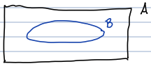
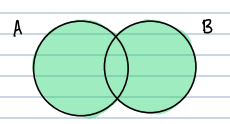
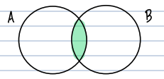
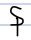
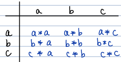
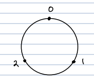
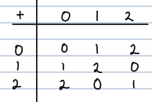

```{r, echo=F, message=F}

```

# W1 D1: Jan. 3rd, 2022

Discussed Chapter 1 (literally). 

- 16th - 18th century math competitions 

- looking to solve polynomials 

- cant solve polynomial greater than 5

- we will see groups of permutations in chapter 7

- don't do Galois thoery in this course (is in 345 and at the end of the book)

  - fun but hard

We are going to prove things with only three rules (in the beginning). 

## Appendix A - Set Theory 

A set is an un-ordered collection of objects. The objects are called elements. 

- set of students , set of real numbers 

We use capital letters (A,B, ...,G, H, K,...) for sets. 

- call group G, and more than one group G, H, K

We use lover case for elements. 

If $x$ is an elements of A, we write $x\in A$. 

- this is read "x is an element of A" or "x is in A"

- $x\notin A$, x is not an element of A

**Ex** : Let $A = \{1,4,3,5\}$. Then $3\in A$, but $b\notin A$.

- culry brackets indicate that order doesn't matter. 

**Ex** : Let B be the set of letters of the alphabet. Then the elements $B=\{a,b,c,...,x,y,z\}$. 

## Common examples of sets

1. The empty set $\emptyset=\{\}$. 

2. The natural numebrs $\mathbb{N}=\{1,2,3,...\}$

3. The integers $\mathbb{Z}=\{...-3,-2,-1,0,1,2,3,...\}$

- Number Theory deal a lot with integers

4. The rational numbers $\mathbb{Q}=\{\frac{m}{n}|m,n\in\mathbb{Z}\text{ and }n\ne0\}$.

- set builder notation, tell the elements and what restrictions on those elements

- could ";" instead of "|"

- bar read "such that"

5. The set of real numbers $\mathbb{R}$

6. The complex numbers $\mathbb{C}=\{a+bi|a,b\in\mathbb{R}\text{ and }i^2=-1\}$

- wont be on test, but are good for showing examples in class

Placing an asterisk in the superscript means delete zero : $\mathbb{R}^*=\{x\in\mathbb{R}|x\ne 0\}$.

Placing a + in the superscript means the set only contains $\mathbb{R}^+=\{x\in\mathbb{R}|x>0\}$. 

# W1 D2: Jan. 5th, 2022

## Definitions

1. A set B is a **subset** of A, denoted $B\subseteq A$, if every element of B is an element of B is an element of A. 



- Ex: $\mathbb{Z\subseteq Q}$ and $\mathbb{Q\subseteq R}$

2. The **union** of two sets A and B, denoted $A\cup B$, is the $$A\cup B=\{x|x\in A\text{ or } x\in B\text{ or both}\}$$



3. The **intersection** of A and B, denoted $A\cap B$, is the set $$A\cap B=\{x|x\in A \text{ and } x\in B\}$$



4. The **Cartesian product** of A and B, denoted $A\times B$, is the set $$A\times B=\{(a,b)|a\in A \text{ and } b\in B\}$$ 

- Ex : Let $A=\{1,2\}$ and $B=\{2,3,4\}$, then $$A\times B=\{(1,2),(1,3),(1,4),(2,2),(2,3),(2,4)\}$$

## Other notations

1. $\Rightarrow$ means "implies"

- Ex : $x=2\Rightarrow x^2=4$

2. $\Leftrightarrow$ means "if and only if"

- Ex : $x=\pm 2\Leftrightarrow x^2=4$

- The statements on either side of $\Leftrightarrow$ are equivalents. 

$\square$ : means end of proof (so does Q.E.D.)

$\forall$ : means for all

$\exists$ : means there exists 

s.t. : such that

w.r.t. : with respect to 

WLOG : without loss of generality 

TFAE : the following are equivalent 



## Operations 

An **operation** * on a set A is a rule which assigns to each ordered pair (a,b) of elements of A exactly one element $a*b$ of A.

- needs to work for each ordered pair. 

- output comes from the same set we started with, A. 

Common Examples (and nonexamples) : 

1. + is an operation on $\mathbb{Z,Q,R,C}$

2. + isn't an operation on $\mathbb{R}*$, because 1, $-1\in \mathbb{R}*$ but $1+(-1)=0\notin\mathbb{R}^*$

3. $\cdot$ is an operation on $\mathbb{Z, Q, R, R^*}$, ect. 

4. - is not an operation on $\mathbb{N}=\{1,2,3,4,...\}$ since $2,5\in\mathbb{N}$ but $2-5=-3\notin\mathbb{N}$

5. $\div$ is not an operation on $\mathbb{Z}$, since $0\in\mathbb{Z}$ and we can't divide by sero. 

6. Matrix addition and multiplication are operations on the set of $2\times 2$ matrices with real entries.

7. Compositions is an operation on sets of functions. 

## Operation Tables 

Suppose * is an operation on $A=\{a,b,c\}$. 



- Ex : Let $A=\{0,1,2\}$. Define an operation + on A, called addition mod 3, as follows : 



To compute $1+2$, start at 1 on the circle and move 2 spaces clockwise. 

So, $1+2=0$ in A. Similarly $2+2=1$ in A. Another way to think about this " 

In the integers $2+2=4$, and 4 is 1 more than 3. 

Here's the operation table: 



Notice the table has the property that every element of A appears exactly once in each row and column. 

- Sudoku property 

## Properties of Opertations 

Let $*$ be an operation on a set A. 

1. $*$ is **commutative** if $a\ne b=b\ne a\forall a,b\in A$. 

Ex : 

(i) $+$ and $\cdot$ of numbers are commutative operations. 

(ii) matrix multiplication is $\underline{\text{not}}$ commutative : 

$$(\begin{smallmatrix} 1 & 1 \\ 1 & 0\end{smallmatrix})(\begin{smallmatrix} 1 & 1 \\ 0 & 1\end{smallmatrix})\ne(\begin{smallmatrix} 1 & 1 \\ 0 & 1\end{smallmatrix})(\begin{smallmatrix} 1 & 1 \\ 1 & 0\end{smallmatrix})$$

(iii) $-$ and $\div$ are $\underline{\text{not}}$ commutative : 

$$1-2\ne 2-1\quad\text{and}\quad\frac{1}{2}\ne\frac{2}{1}$$

(iv) function composition $\underline{\text{isn't}}$ commutative : 

Let $f(x)=x^2$ and $g(x)=x+1$. 

Then $(f\circ g)(x)=f(g(x))=(x+1)^2$, but $(g\circ f)(x)=g(f(x))=x^2+1$. 

# W1 D3: Jan. 7th, 2022

## Ch. 2 - Operations, Cont. 

Let A be a set. An $\underline{\text{operation}}$ * on A is a rule which assigns to each ordered pair of elements of A exactly one element $a*b\in A$. 

**Remarkds :**

1. a*b must be defined for every choice of $a,b\in A$.

2. For each choice of a and b in A, $a*b$ can only equal one element. (We can't have something like $a*b=\pm 3$.)

3. For each choice of a and b in A, a*b must also be in the set A. 

### Properties of Operations 

1. We say * is $\underline{\text{commutative}}$ if $a*b=b*a$ for all $a,b\in A$ 

2. We say * is $\underline{\text{associative}}$ if $(a*b)*c=a*(b*c)\forall a,b,c\in A$. 

Examples :

- $+$ is associative. 

- Multiplication of numbers and square matrices are associative perations.

- Subtraction of numbers $\underline{\text{isn't}}$ associative : 

  - $(1-2)-3=-1-3=-4$
  
  - $1-(2-3)=1-(-1)=2$
  
  - NOT EQUAL !! 
  
3. If there exists $e\in A$ such that $e*a=a*e=a$ for all $a\in A$ we call e the $\underline{\text{identity element}}$ in A with respect to *. 

Examples : 

- zero is the identity w.r.t addition. 

- $1\in \mathbb{R}$ is the identy w.r.t. multiplication of numebrs

- zero isn't the identity w.r.t. subtraction, since 0-b=-b instead of b. 

4. If $e\in A$ is the identity w.r.t. * and $a,b\in A$ are such that $$a*b=b*a=e$$, we call a and b $\underline{\text{inverses}}$ of one another. 

$\underline{\text{Notation: }}$ $a=b^{-1}\quad$ and $b=a^{-1}$

Examples : 

- The inverese of $a\in \mathbb{R}$ w.r.t. + and -a, since $a+(-a)=(-a)+a=0$.

- The inverse of $a\in \mathbb{R}^*$ w.r.t. multiplication is $\frac{1}{a}$ since $$a\cdot\frac{1}{a}=\frac{1}{a}\cdot a=1$$

### Example 1: (Similar to #2, 3 on HW 1)

Define * on $\mathbb{R}$ by $a*b=a+2b+4$. 

- "First # plus two times the second # plus 4"

For example, $3*7=3+2\cdot 7+4=21$ and $7*3=7+2\cdot3+4=17$

(a) Since $3*7=7*3$, the operation * is not commutative. 

(b) Is * associative? 

\begin{equation}
\label{d3 b1}
\begin{split}
(a*b)*c &= (a+2b+4)*c\\
&=a+2b+4+2c+4\\
&=a+2b+2c+8
\end{split}
\end{equation}

\begin{equation}
\label{d3 b2}
\begin{split}
a*(b*c) &= a*(b+2c+4)\\
&=a+2(b+2c+4)+4\\
&=a+2b+4c+12
\end{split}
\end{equation}

Since $(a*b)*c\ne a*(b*c)$, * isn't associative. 

(c) Is there an identity $e\in\mathbb{R}$ wrt *?

The process : Pretend $e\in\mathbb{R}$ exists. This means $e*a=a$. 

If so, then this value of c is the identity. If not, there is no identity. 

\begin{equation}
\label{d3 c}
\begin{split}
e*a = a &\Rightarrow a+2e+4=a\\
&\Rightarrow 2e+4=0\\
&\Rightarrow e=-2
\end{split}
\end{equation}

"When solving for e, the answer must be a constant element of the set, i.e. Can't involve variables."

Check other order:

$$e*a=-2*a=-2+2a+4=2a+2$$

Since $-2*a\ne a$, then no there is no identity in $\mathbb{R}$ w.r.t. *. 

### Example 2: 

Define * on $\mathbb{R}$ by $a*b=a+b+ab$

(a) Show that * is commutative : 

\begin{equation}
\label{d3 2a}
\begin{split}
a*b &= a+b+ab\\
&= b+a+ab\quad\text{ since + is commutative}\\
&= b+a+ba\quad\text{since }\cdot\text{ is commutative}\\
&= b*a
\end{split}
\end{equation}

(b) Is there an identity w.r.t. *? Yes, lets show $0\in\mathbb{R}$ is the identity: $a*0=a+0+a\cdot 0=a$

Why must it be true that $0*a=a$ as well? We already showed * is commutative.

(c) Which elements $a\in\mathbb{R}$ have inverses w.r.t. *?

Process : 

Suppose $b=a^{-1}$. Then $a*b=0$. (Identity found in part (c))

Try to solve this equation for b. 

Once we solve for b, check if $b*a=0$ as well. 

\begin{equation}
\label{d3 2c}
\begin{split}
a*b=0 &\Rightarrow a+b+ab=0\\
&\Rightarrow b(1+a)=-a\\
&\Rightarrow b =\frac{-a}{1+a}
\end{split}
\end{equation}

So every $a\in\mathbb{R}$ except -1 has an inverse given by $$a^{-1}=\frac{-a}{1+a}$$. 

Note: We didn't need to check that when $\frac{-a}{1+a}$, $b*a=0$ as well, since we know * is commutative. 

# W2 D4: Jan. 10th, 2022

# W2 D5: Jan. 12th, 2022

# W2 D6: Jan. 14th, 2022

