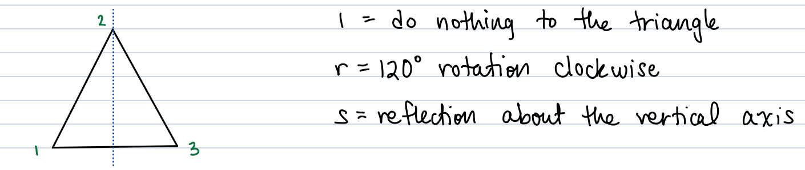

```{r, echo=F, message=F}

```

# W1D1: Jan. 3rd, 2022

Discussed Chapter 1 (literally). 

- 16th - 18th century math competitions 

- looking to solve polynomials 

- cant solve polynomial greater than 5

- we will see groups of permutations in chapter 7

- don't do Galois thoery in this course (is in 345 and at the end of the book)

  - fun but hard

We are going to prove things with only three rules (in the beginning). 

## Appendix A - Set Theory 

A set is an un-ordered collection of objects. The objects are called elements. 

- set of students , set of real numbers 

We use capital letters (A,B, ...,G, H, K,...) for sets. 

- call group G, and more than one group G, H, K

We use lover case for elements. 

If $x$ is an elements of A, we write $x\in A$. 

- this is read "x is an element of A" or "x is in A"

- $x\notin A$, x is not an element of A

**Ex** : Let $A = \{1,4,3,5\}$. Then $3\in A$, but $b\notin A$.

- culry brackets indicate that order doesn't matter. 

**Ex** : Let B be the set of letters of the alphabet. Then the elements $B=\{a,b,c,...,x,y,z\}$. 

## Common examples of sets

1. The empty set $\emptyset=\{\}$. 

2. The natural numebrs $\mathbb{N}=\{1,2,3,...\}$

3. The integers $\mathbb{Z}=\{...-3,-2,-1,0,1,2,3,...\}$

- Number Theory deal a lot with integers

4. The rational numbers $\mathbb{Q}=\{\frac{m}{n}|m,n\in\mathbb{Z}\text{ and }n\ne0\}$.

- set builder notation, tell the elements and what restrictions on those elements

- could ";" instead of "|"

- bar read "such that"

5. The set of real numbers $\mathbb{R}$

6. The complex numbers $\mathbb{C}=\{a+bi|a,b\in\mathbb{R}\text{ and }i^2=-1\}$

- wont be on test, but are good for showing examples in class

Placing an asterisk in the superscript means delete zero : $\mathbb{R}^*=\{x\in\mathbb{R}|x\ne 0\}$.

Placing a + in the superscript means the set only contains $\mathbb{R}^+=\{x\in\mathbb{R}|x>0\}$. 

# W1D2: Jan. 5th, 2022

## Definitions

1. A set B is a **subset** of A, denoted $B\subseteq A$, if every element of B is an element of B is an element of A. 


- Ex: $\mathbb{Z\subseteq Q}$ and $\mathbb{Q\subseteq R}$

2. The **union** of two sets A and B, denoted $A\cup B$, is the $$A\cup B=\{x|x\in A\text{ or } x\in B\text{ or both}\}$$


3. The **intersection** of A and B, denoted $A\cap B$, is the set $$A\cap B=\{x|x\in A \text{ and } x\in B\}$$


4. The **Cartesian product** of A and B, denoted $A\times B$, is the set $$A\times B=\{(a,b)|a\in A \text{ and } b\in B\}$$ 

- Ex : Let $A=\{1,2\}$ and $B=\{2,3,4\}$, then $$A\times B=\{(1,2),(1,3),(1,4),(2,2),(2,3),(2,4)\}$$

## Other notations

1. $\Rightarrow$ means "implies"

- Ex : $x=2\Rightarrow x^2=4$

2. $\Leftrightarrow$ means "if and only if"

- Ex : $x=\pm 2\Leftrightarrow x^2=4$

- The statements on either side of $\Leftrightarrow$ are equivalents. 

$\square$ : means end of proof (so does Q.E.D.)

$\forall$ : means for all

$\exists$ : means there exists 

s.t. : such that

w.r.t. : with respect to 

WLOG : without loss of generality 

TFAE : the following are equivalent 


## Operations 

An **operation** * on a set A is a rule which assigns to each ordered pair (a,b) of elements of A exactly one element $a*b$ of A.

- needs to work for each ordered pair. 

- output comes from the same set we started with, A. 

Common Examples (and nonexamples) : 

1. + is an operation on $\mathbb{Z,Q,R,C}$

2. + isn't an operation on $\mathbb{R}*$, because 1, $-1\in \mathbb{R}*$ but $1+(-1)=0\notin\mathbb{R}^*$

3. $\cdot$ is an operation on $\mathbb{Z, Q, R, R^*}$, ect. 

4. - is not an operation on $\mathbb{N}=\{1,2,3,4,...\}$ since $2,5\in\mathbb{N}$ but $2-5=-3\notin\mathbb{N}$

5. $\div$ is not an operation on $\mathbb{Z}$, since $0\in\mathbb{Z}$ and we can't divide by sero. 

6. Matrix addition and multiplication are operations on the set of $2\times 2$ matrices with real entries.

7. Compositions is an operation on sets of functions. 

## Operation Tables 

Suppose * is an operation on $A=\{a,b,c\}$. 


- Ex : Let $A=\{0,1,2\}$. Define an operation + on A, called addition mod 3, as follows : 


To compute $1+2$, start at 1 on the circle and move 2 spaces clockwise. 

So, $1+2=0$ in A. Similarly $2+2=1$ in A. Another way to think about this " 

In the integers $2+2=4$, and 4 is 1 more than 3. 

Here's the operation table: 


Notice the table has the property that every element of A appears exactly once in each row and column. 

- Sudoku property 

## Properties of Opertations 

Let $*$ be an operation on a set A. 

1. $*$ is **commutative** if $a\ne b=b\ne a\forall a,b\in A$. 

Ex : 

(i) $+$ and $\cdot$ of numbers are commutative operations. 

(ii) matrix multiplication is $\underline{\text{not}}$ commutative : 

$$(\begin{smallmatrix} 1 & 1 \\ 1 & 0\end{smallmatrix})(\begin{smallmatrix} 1 & 1 \\ 0 & 1\end{smallmatrix})\ne(\begin{smallmatrix} 1 & 1 \\ 0 & 1\end{smallmatrix})(\begin{smallmatrix} 1 & 1 \\ 1 & 0\end{smallmatrix})$$

(iii) $-$ and $\div$ are $\underline{\text{not}}$ commutative : 

$$1-2\ne 2-1\quad\text{and}\quad\frac{1}{2}\ne\frac{2}{1}$$

(iv) function composition $\underline{\text{isn't}}$ commutative : 

Let $f(x)=x^2$ and $g(x)=x+1$. 

Then $(f\circ g)(x)=f(g(x))=(x+1)^2$, but $(g\circ f)(x)=g(f(x))=x^2+1$. 

# W1D3: Jan. 7th, 2022

## Ch. 2 - Operations, Cont. 

Let A be a set. An $\underline{\text{operation}}$ * on A is a rule which assigns to each ordered pair of elements of A exactly one element $a*b\in A$. 

**Remarks :** 

1. a*b must be defined for every choice of $a,b\in A$.

2. For each choice of a and b in A, $a*b$ can only equal one element. (We can't have something like $a*b=\pm 3$.)

3. For each choice of a and b in A, a*b must also be in the set A. 

### Properties of Operations 

1. We say * is $\underline{\text{commutative}}$ if $a*b=b*a$ for all $a,b\in A$ 

2. We say * is $\underline{\text{associative}}$ if $(a*b)*c=a*(b*c)\forall a,b,c\in A$. 

Examples :

- $+$ is associative. 

- Multiplication of numbers and square matrices are associative perations.

- Subtraction of numbers $\underline{\text{isn't}}$ associative : 

  - $(1-2)-3=-1-3=-4$
  
  - $1-(2-3)=1-(-1)=2$
  
  - NOT EQUAL !! 
  
3. If there exists $e\in A$ such that $e*a=a*e=a$ for all $a\in A$ we call e the $\underline{\text{identity element}}$ in A with respect to *. 

Examples : 

- zero is the identity w.r.t addition. 

- $1\in \mathbb{R}$ is the identy w.r.t. multiplication of numebrs

- zero isn't the identity w.r.t. subtraction, since 0-b=-b instead of b. 

4. If $e\in A$ is the identity w.r.t. * and $a,b\in A$ are such that $$a*b=b*a=e$$, we call a and b $\underline{\text{inverses}}$ of one another. 

$\underline{\text{Notation: }}$ $a=b^{-1}\quad$ and $b=a^{-1}$

Examples : 

- The inverese of $a\in \mathbb{R}$ w.r.t. + and -a, since $a+(-a)=(-a)+a=0$.

- The inverse of $a\in \mathbb{R}^*$ w.r.t. multiplication is $\frac{1}{a}$ since $$a\cdot\frac{1}{a}=\frac{1}{a}\cdot a=1$$

### Example 1: (Similar to #2, 3 on HW 1)

Define * on $\mathbb{R}$ by $a*b=a+2b+4$. 

- "First # plus two times the second # plus 4"

For example, $3*7=3+2\cdot 7+4=21$ and $7*3=7+2\cdot3+4=17$

(a) Since $3*7\ne7*3$, the operation * is not commutative. 

(b) Is * associative? 

\begin{equation}
\label{d3 b1}
\begin{split}
(a*b)*c &= (a+2b+4)*c\\
&=a+2b+4+2c+4\\
&=a+2b+2c+8
\end{split}
\end{equation}

- think of (a+2b+4) is first # and c is the 2nd # 

\begin{equation}
\label{d3 b2}
\begin{split}
a*(b*c) &= a*(b+2c+4)\\
&=a+2(b+2c+4)+4\\
&=a+2b+4c+12
\end{split}
\end{equation}

Since $(a*b)*c\ne a*(b*c)$, * isn't associative. 

(c) Is there an identity $e\in\mathbb{R}$ wrt *?

The process : Pretend $e\in\mathbb{R}$ exists. This means $e*a=a\forall a\in\mathbb{R}$.

Rewrite this equation, then solve for e. If we find a solution for $e\in\mathbb{R}$, check if $$e*a=a$$

If so, then this value of e is the identity. If not, there is no identity. 

\begin{equation}
\label{d3 c}
\begin{split}
e*a = a &\Rightarrow a+2e+4=a\\
&\Rightarrow 2e+4=0\\
&\Rightarrow e=-2
\end{split}
\end{equation}

"When solving for e, the answer must be a constant element of the set, i.e. Can't involve variables."

Check other order:

$$e*a=-2*a=-2+2a+4=2a+2$$

Since $-2*a\ne a$, then no there is no identity in $\mathbb{R}$ w.r.t. *. 

### Example 2: 

Define * on $\mathbb{R}$ by $a*b=a+b+ab$

(a) Show that * is commutative : 

\begin{equation}
\label{d3 2a}
\begin{split}
a*b &= a+b+ab\\
&= b+a+ab\quad\text{ since + is commutative}\\
&= b+a+ba\quad\text{since }\cdot\text{ is commutative}\\
&= b*a
\end{split}
\end{equation}

(b) skip associativity for time

(c) Is there an identity w.r.t. *? Yes, lets show $0\in\mathbb{R}$ is the identity: $a*0=a+0+a\cdot 0=a$

Why must it be true that $0*a=a$ as well? We already showed * is commutative.

(d) Which elements $a\in\mathbb{R}$ have inverses w.r.t. *?

Process : 

Suppose $b=a^{-1}$. Then $a*b=0$. (Identity found in part (c))

Try to solve this equation for b. 

Once we solve for b, check if $b*a=0$ as well. 

\begin{equation}
\label{d3 2c}
\begin{split}
a*b=0 &\Rightarrow a+b+ab=0\\
&\Rightarrow b(1+a)=-a\\
&\Rightarrow b =\frac{-a}{1+a}
\end{split}
\end{equation}

So every $a\in\mathbb{R}$ except -1 has an inverse given by $$a^{-1}=\frac{-a}{1+a}$$. 

Note: We didn't need to check that when $\frac{-a}{1+a}$, $b*a=0$ as well, since we know * is commutative. 

# W2D4: Jan. 10th, 2022

## Ch.3 - The Definition of a Group 

Let G be a set and * an operation on G. Suppose

(i) `*` is associative (i.e. $(a*b)*c=a*(b*c))\forall a,b,c\in G$.

(ii) There is an identity element $e\in G$. (Recall, $e*a=a*e=a\forall a\in G$)

(iii) Every element $a\in G$ has an inverse $a^{-1}\in G$. (Recall, $a*a^{-1}=a^{-1}*a=e$.) 

Then we call $\langle G,*\rangle$ a $\underline{\text{group}}$. 

If, in addition, * is commutative we call $\langle G,*\rangle$ an $\underline{\text{abelian group}}$. 

## Examples of Infinite Groups (and nonexamples)

1. $\langle \mathbb{Z},+\rangle$ , $\langle\mathbb{Q},+\rangle$, and $\langle\mathbb{R},+\rangle$ are abelian groups (the identity is e=0 [addititve identity] and the inverse of a is $-a$ [additive inverse or negative]

2. $\langle\mathbb{Z},\cdot\rangle$ isn't a group since $2\in\mathbb{Z}$ but the multiplicative inverse of 2, which is $\frac{1}{2}$, isn't in $\mathbb{Z}$. 

3. $\langle \mathbb{N},+\rangle$ isn't a group since the additive identity, 0, isn't in $\mathbb{N}$.

4. $\langle\mathbb{Q}^*,\cdot\rangle$, $\langle\mathbb{R}^*,\cdot\rangle$, $\langle\mathbb{Q}^+,\cdot\rangle$, $\langle\mathbb{R}^+,\cdot\rangle$ are abelian grops. (the identity is e=1 and the inverse of a is $\frac{1}{a}$)

--- 

We call a group $\langle G,*\rangle$ a $\underline{\text{finite group}}$ if $|G|<\infty$, i.e. the # of elements in G is finite. We call $|G|$ the $\underline{\text{order}}$ (size) of G. 

## Examples of finite group:

Define $\mathbb{Z}_6=\{0,1,2,3,4,5\}$, called the $\underline{\text{integers mod 6}}$. 

Define an operation +, called addition mod 6 as follows : 


To Compute $4+5$: start at 4 and move 5 spaces clockwise. So in $\mathbb{Z}_6$

$$4+5=3$$

- note : we can also think that $4+5=9-6=3$. 

The identity element in $\mathbb{Z}_6$ is zero. What's the inverse of 4 in $\mathbb{Z}$?

Think of it this way: what needs to be added to 4 to get 0? 

In $\mathbb{Z}$, $4+2=0$, so 2 is the inverse of 4. 

---

For any $n\geq 2$, define $\mathbb{Z}_n=\{0,1,2,3,...,n-1\}$. With addition mod n this forms a finite abelian group. 

The inverse of 0 is 0. For any nonzero $a\in\mathbb{Z}_n$, the inverse of a is $n-a$, since in $\mathbb{Z}_n$

$$a+(n-a)=0$$

Ex: In $\mathbb{Z}_8$, 7+5=4 (since 12 is 4 more than 8 in $\mathbb{Z}$). 

## HW 1 #4

Let $G=\{(x,y)\in\mathbb{R}\times\mathbb{R}|x\ne0\}$. Define * on G by $$(a,b)*(c,d)=(ac,ad+bc)$$

In this problem, show $\langle G,*\rangle$ is an abelian group. 

For example, 

$(1,3)*(5,2)=(1\cdot 5, 1\cdot 2+3\cdot 5)=(5,17)$. 

"Look at Ch. 3 B for similar problems."

Lets show * is associative : 

\begin{equation}
\label{d4e1}
\begin{split}
((a,b)*(c,d))*(f,g) &= (ac,ad+bc)*(f,g)\\
&= (acf,acg+(ad+bc)f)\\
&= (acf, acg+adf+bcf)
\end{split}
\end{equation}

\begin{equation}
\label{d4e2}
\begin{split}
(a,b)*((c,d)*(f,g)) &= (a,b)*(af,cg+df)\\
&= (acf,a(cg+df)+bcf)\\
&= (acf, acg+adf+bcf)
\end{split}
\end{equation}

Identity : Solve $(a,b)*(e_1,e_2)=(a,b)$ for $e_1,e_2\in\mathbb{R}$.

- $e_1$ and $e_2$ are the identities 

## Examples of nonabelian group

The $\underline{\text{dihedral group}}$ of degree 3, $D_3$, is the group of symmetries of an equilateral triangle. 



The group has 6 elements : $D_3=\{1,r,r^2,s,sr,sr^2\}$ , where, for example sr means rotate first then reflect. (Why are we going right to left? We will view this group's operation as function composition starting in Ch. 7.)

- 6 is the smallest size nonabelian, dihedral group

Why isn't $r^3$ in the set? We consider $r^3=1$ since the triangle looks the same after $360^o$ rotation. Similarly, $s^2=1$. 

To see that $D_3$ is nonabelian, check that $sr\ne rs$.


Before Wednesday, consider rs using triangles. 

- rs : the operation goes right to left, so rs means reflect first then rotate. 

# W2D5: Jan. 12th, 2022

Let G be a set and `*` be an operation on G. We call $\langle G,*\rangle$ a $\underline{\text{group}}$ if 

(i) `*` is associative 

(ii) $\exists $ identity element $e\in G$. 

(iii) $\forall$ elements $a\in G$ has an inverse $a^{-1}\in G$. 

$\underline{\text{Comment on notation:}}$ We'll write G instead of $\langle G, *\rangle$ when there is no confusion about what the operation * is. 

## Ch.4 - Properties of Groups 

### Proposition 1

Let G be a group. Then G has exactly one identity element. 

$\underline{\text{Proof}}$: Suppose $e_1,e_2\in G$ are identity elements. 

Since $e\in G$ is an identity, $$e_1*e_2=e_2.$$

Similarly, since $e_2\in G$ is an identity, $$e_1*e_2=e_1.$$

Combining, we get $$e_2=e_1*e_2=e_1\quad\Rightarrow\quad e_2=e_1.$$

So, G has exactly one identity element. $\square$

### Proposition 2

Every element of G has exactly one inverse. 

$\underline{\text{Proof:}}$ Let $a\in G$. Suppose $b_1,b_2\in G$ are inverses of a. By definition $$b_1*(a*b_2)=b_1*e=b_1.$$

Similarly, $$(b_1*a)*b_2=e*b_2=b_2$$

By associativity, $b_1*(a*b_2)=(b_1*a)*b_2$, implying $b_1=b_2$. Hence, the element $a\in G$ has exactly one inverse in G. Since $a\in G$ was arbitrary, every element of G has exactly one inverse. $\square$. 

$\underline{\text{Comment about notation:}}$ In arbitrary groups, we'll write ab instead of $a*b$. We'll call ab the $\underline{\text{product}}$ of a and b in G (even if the operation isn't multiplication). 

- "can't assume inverse"

### Theorem 1 (Cancellation Law)

Let G be a group and let $a,b,c\in G$ Then 

(i) $ab=ac\quad\Rightarrow\quad b=c$

(ii) $ba=ca\quad\Rightarrow\quad b=c$

**$\underline{\text{Warning}}$** In an arbitrary group, $ab=ca$ doesn't imply that $b=c$. 

$\underline{\text{Ex}}$ : Recall $D_3=\{1,r,r^2,s,sr,sr^2\}$ is the group of symmetries of an equilateral triangle. 


In $D_3$, you can show that $sr=r^2s$. However, $r\ne r^2$. So, we can't cancel the s's in the equation $sr=r^2s$. 

### Proof of part (iii) of the Cacellation Theorem

Assume that $ba=ca$. We know the element $a\in G$ has an inverse $a^{-1}\in G$. Let's "multiply" by $a^{-1}$ on the right: 

\begin{equation}
\label{cancellation (iii)}
\begin{split}
ba=ca &\Rightarrow (ba)a^{-1}=(ca)a^{-1}\\
&\Rightarrow b(aa^{-1})=c(aa^{-1})\text{ ,by associativity}\\
&\Rightarrow be=ce\quad\text{, since }aa^{-1}=e\\
&\Rightarrow b=c
\end{split}
\end{equation}

$\underline{\text{Ex}}$: Let G be a group and let $a,b,c,x\in G$. Solve the following for x: 

\begin{equation}
\label{d5e solve for x}
\begin{split}
x^2b=xa^{-1}c &\Rightarrow xxb=xa^{-1}c\\
&\Rightarrow xb=a^{-1}c\quad\text{by left cancellation}\\
&\Rightarrow xbb^{-1}=a^{-1}cb^{-1}\\
&\Rightarrow x=a^{-1}cb^{-1}
\end{split}
\end{equation}

Note: HW problem about division, "the side matters"

$\underline{\text{Ex}}$: Solve this system of equations for x: $ax^2=b$ and $x^3=e$

\begin{equation}
\label{d5e solve soe}
\begin{split}
ax^2=b &\Rightarrow ax^2x=bx\\
&\Rightarrow ax^3=bx\\
&\Rightarrow ae=bx\text{ , since }x^3=e\\
&\Rightarrow a=bx\text{ , since }e\text{ is the identity}\\
&\Rightarrow b^{-1}a=b^{-1}bx\\
&\Rightarrow x=b^{-1}a
\end{split}
\end{equation}

### Theorem 2

Let G be a group and let $a,b\in G$. If $ab=e$, then a and b are inverses, i.e. $a=b^{-1}$ and $b=a^{-1}$. 

(Note: we don't ahve to check if $ba=e$ as well.)

$\underline{\text{Proof:}}$ Suppose $ab=e$. Let's show that $a=b^{-1}$. 

\begin{equation}
\label{T2 Proof}
\begin{split}
ab=e &\Rightarrow ab=b^{-1}b\text{ , since }b^{-1}b=e\\
&\Rightarrow a=b^{-1}
\end{split}
\end{equation}

When solving equations or simplifying expressions in an _arbitrary_ group, we can: 

1. use left or right cancellation 

2. "Multiply" both sides of an equation by the same element, as long as we're consistent with placing the element on the left or right. 

3. Take the inverse of both sides of an equation. 

### Theorem 3

Let G be a group and let $a,b\in G$. 

(i) (Socks and Shoes) $$(ab)^{-1}=b^{-1}a^{-1}$$

(ii) $(a^{-1})^{-1}=a$

$\underline{\text{Proof:}}$ 

(i) We want to show that $ab$ and $b^{-1}a^{-1}$ are inverses of one another. By Theorem 2, we just need to show their product is e:

\begin{equation}
\label{T3 Proof}
\begin{split}
(ab)(b^{-1}a^{-1})&=a(bb^{-1})a^{-1}\text{ , by associativity}\\
&= aea^{-1} \quad\text{, since }bb^{-1}=e\\
&= aa^{-1}\quad\text{, since }ae=a\\
&= e\quad\text{, since } aa^{-1}.
\end{split}
\end{equation}

So, by Theorem 2, $ab$ and $b^{-1}a^{-1}$ are inverses, i.e. $$(ab)^{-1}=b^{-1}a^{-1}.$$

(ii) We want to show that the inverse of $a^{-1}$ is a. By Theorem 2, we just need to consider their product: 

$$a^{-1}a=e\quad\Rightarrow\quad(a^{-1})^{-1}=a.\quad\quad\quad\quad\quad\square$$

$\underline{\text{Note: }}(abc)^{-1}=c^{-1}b^{-1}a^{-1}$ and $(abcd)^{-1}=d^{-1}c^{-1}b^{-1}a^{-1}$, ect.  

# W2D6: Jan. 14th, 2022

Reminder : PSU closed Monday 1/17, so there's no class

Homework 2 will be posted over the weekend. 

## Ch 4. Continued 

Let G be a finite group. 

$\underline{\text{Fact}}$: Every row and column of G's operation table contains each element of G exactly once. 

Let $x,g\in G$. Show that g appears in the row for the element x. 


- "x times what will be equal to g?"

Now lets show g can't appear twice in x's row: 


This contradicts the way we make operation tables. (We list each element above the table only once.) So g appears only once in x's row. 

### Examples 

$\underline{\text{Ex}}$: Consider $\mathbb{Z}_4=\{0,1,2,3\}$, with addition mod 4. 


$\underline{\text{Ex}}$: Let $G=\{e,a,b,c\}$ be a group of size 4 such that $$a^2=b^2=c^2=e.$$

(This group is called the Klein 4 Group)

There is only one way to fill out the operation table : 


### Direct Product of Groups (Ch 4 G Problems)

Let $\langle G,*_G\rangle$ and $\langle H,*_H\rangle$ be groups. The $\underline{\text{direct product}}$ of G and H is the set $$G\times H=\{(g,h)|g\in G\text{ and } h\in H\}$$

with operation $$(g_1,h)(g_2,h_2)=(g_1*_Gg_2,h_1*_Hh_2)=\underline{(g_1g_2,h_1h_2)}\quad\leftarrow\text{ simplifying notation}$$

Identity in $G\times H$: $e_G,e_H$

Inverses in $G\times H$: $(g,h)^{-1}=(g^{-1},h^{-1})$

### Examples 

$\underline{\text{Ex}}$: List the elements of $\mathbb{Z}_2\times\mathbb{Z}_3$. 

$$\mathbb{Z}_2\times\mathbb{Z}_3=\{(0,0),(0,1),(0,2),(1,0),(1,1),(1,2)\}$$

In this group : $(1,1)+(1,1)=(1+1,1+1)=(0,2)$

and the invese of $(1,1)$ is $(1,2)$, since $(1,1)+(1+2)=(0,0)$. 

$\underline{\text{Ex}}$: Another group size 4 : $\mathbb{Z}_2\times \mathbb{Z}_2=\{(0,0),(0,1),(0,2),(1,0), (1,1), (1,2),(2,0),(2,1),(2,2)\}$

This group has the property that any element added to itself is the idenity : $$(0,1)+(0,1)=(0+0,1+1)=(0,0)$$

$\underline{\text{Ex}}$: This group has the property that any element added to itself is the identity: 

For example, $(0,1)+(0,1)=(0+0,1+1)=(0,0)$

## Ch.5 - Subgroups 

Let G be a group. A subset $H\subseteq G$ is called a $\underline{\text{subgroup}}$ of G if : 

(i) $e\in H$ (Note : e is the identity from the group G.)

(ii) For all $a,b\in H$ , $ab \in H$ (We say H is closed under the operation)

(iii) For all $a\in H$ , $a^{-1}\in H$. (We say H is closed under inverses)

Note: If H is a subgroup of G, H and G must have the same operation. 

What does this definition look like if the operation is +?

(i) $0\in H$

(ii) $\forall a,b\in H$ , $a+b\in H$.

(iii) $\forall a\in H$ , $-a\in H$.

### Ex: Subgroups of $\langle\mathbb{Z},+\rangle$

1. Why isn't $\mathbb{Z}_4$ a subgroup of $\mathbb{Z}$? These groups have different operations (addition vs. addition mod 4). 

2. $\{0\}$ is called a trivial subgroup of $\mathbb{Z}$.

3. $\emptyset=\{\}$ isn't a subgroup because it doesn't contain the identity. 

4. The even integers $2\mathbb{Z}=\{...,-4,-2,0,2,4,6,...\}$ are a subgroup of $\mathbb{Z}$. 

Proof : 

(i) $0\in 2\mathbb{Z}$ because $0=2\cdot0$

(ii) Let $a,b\in\mathbb{Z}$. Then $a=2m$ and $b=2n$, for some $m,n\in\mathbb{Z}$. So, $$a+b=2m+2n=2(m+n)\in2\mathbb{Z}$$, since $m+n\in\mathbb{Z}$. Therefore $2\mathbb{Z}$ is colsed under +. 

(iii) Let $a\in\mathbb{Z}$. Then $a=2m$ for some $m\in\mathbb{Z}$. So, $$-a=-2m=2(-m)\in2\mathbb{Z}\quad\quad \square$$

5. For any fixed integer $k\in\mathbb{Z}$, $$k\mathbb{Z}=\{...,-2k,-k,0,k,2k,3k,...\}$$ is a subgroup of $\mathbb{Z}$. 

### Example 

Show $H=\{0,3,6,9\}$ is a subgroup of $\mathbb{Z}_{12}$ (with the operation of addition mod 12). 

Make the operation table for H : 

Note : we don't know if H is a group yet, so we can't use sudoku property (hence green writing). 


(ii) H is closed under + since all elements in the table are in H. 

(iii) Since every row and column contains zero, H is closed under inverses. (For example, the highlighted row and column above show that the inverse of 9 in H is 3. )

# W3D7: Jan. 19th, 2022

## Ch. 5 Continued

Let G be a group. We call a subset $h\subseteq G$ a $\underline{\text{subgroup}}$ of G if 

(i) the identity of e is in H

(ii) for all $a,b\in H$ , $ab\in H$

(iii) for all $a\in H$ , $a^{-1}\in H$

$\underline{\text{Note:}}$ If H is a subgroup of G. H and G have the same operation. 

- don't have to check associativity because it is assumed becasue G is a group. 

$\underline{\text{Notation:}}$ $H\leq G$

### Example: not a subgroup 

Let $G=\mathbb{Z}_5=\{0,1,2,3,4\}$. Why isn't $H=\{0,2,4\}$ a subgroup of G? 

One reason : $2,4\in H$ , but $2+4=1\in H$ (we'er using the operation from $\mathbb{Z}$'s). 

Another reason : $4\in H$ , but the inverse of 4 in $\mathbb{Z}$'s (which is 1) isn't in H. 

### Example: cyclic subgroup

Subgroups of $\langle\mathbb{R}^*,\cdot\rangle$

One way we can generate subgroups of $\mathbb{R}^*$ is to take a fixed element, say 7, and form the $\underline{\text{cyclic subgroup}}$ generated by 7: $$\langle 7\rangle=\{...,\frac{1}{7^3},\frac{1}{7^2},\frac{1}{7},1,7,7^2,7^3,7^4,...\}=\{7^n|n\in\mathbb{Z}\}.$$

$\underline{\text{Note:}}$ This is the smallest subgroup of $\mathbb{R^*}$ that contains 7. 

### Example: cyclic subgroups

List the cyclic subgroups of $\mathbb{Z}_6=\{0,1,2,3,4,5\}$. 

$\langle 0\rangle=\{0\}$

$\langle 1\rangle=\{0,1,2,3,4,5\}=\mathbb{Z}_6$

$\langle 2\rangle=\{0,2,4\}$

$\langle 3\rangle=\{0,3\}$

You can show that $\langle 4\rangle=\{0,4,2\}=\langle 2\rangle$ and $\langle 5\rangle=\{0,5,4,3,2,1\}=\mathbb{Z}_6$. We will see more about subgroups of $\mathbb{Z}_n$ in Ch. 11. 

Since $\mathbb{Z}_6=\langle 1\rangle$, we call $\mathbb{Z_6}$ a $\underline{\text{cyclic group}}$ with generator 1. 

### Example: $H\leq\mathbb{R}\times\mathbb{R}$

Let $H=\{(x,y)\in\mathbb{R}\times\mathbb{R}|y=4x\}$. Show $H\leq\mathbb{R}\times\mathbb{R}\quad\quad\leftarrow$ The operation is coordinate - wise addition.

(Examples of elements of H: (0,0), (1,4), (2,8), etc. )

(i) Since $0=4\cdot 0$, the identity $(0,0)$ is in H. 

(ii) Let $(a_1,a_2), (b_1,b_2)\in H$. Then, by definition, $$a_2=4a,\quad\text{and}\quad b_2=4b_1$$

So, 

\begin{equation}
\label{D7a}
\begin{split}
(a_1,a_2)+(b_1+b_2) &= (a_1+b_1,a_2+b_2)\\
&= (a_1+b_1,4a_1+4ab_1)\\
&= (a_1+b_1,y(a_1+b_1))\\
&\in H
\end{split}
\end{equation}

$\Rightarrow$ H is closed under coordinate-wise addition. 

(ii) Let $(a_1,a_2)\in H$. Then $a_2=4a$. So, $$-(a_1,a_2)=(-a_1,-a_2)=(-a_1,-4a_1)=(-a_1,4(-a_1))\in H.$$

$\Rightarrow$ H is closed under inverses. Completing the proof that $H\leq\mathbb{R}\times\mathbb{R}\quad\quad\square$.

### Example: (similar to the Ch.5 C problems)

Let G be an abelian group and let $$H=\{x\in G|x^2=e\}.$$

  Recall, $x^2=xx$
  
Prove $H\leq G$.

Proof:

(i) Since $e^2=ee=e$, the identity e is in H. 

(ii) Let $a, b\in H$. Then $a^2=e$ and $b^2=e$.

  (We want to show that $ab\in H$. To do this, we must show that $(ab)^2=e$.)
  
\begin{equation}
\label{D7b}
\begin{split}
\text{So,}\quad (ab)^2 &= abab\\
&=aabb\quad\text{, since G is abelian}\\
&= a^2b^2\\
&= ee\\
&=e
\end{split}
\end{equation}

implying that $ab\in H$.

(iii) let $a\in H$. Then $a^2=e$.

  (We want to show $a^{-1}\in H$. To do this, we need to show $(a^{-1})^2=e$.)
  
\begin{equation}
\label{D7c}
\begin{split}
(a^{-1})^2 &= a^{-1}a^{-1}\\
&= a^{-1}a^{-1}e\\
&= a^{-1}a^{-1}a^2\quad\text{, since }a^2=e\\
&= a^{-1}a^{-1}aa\\
&= a^{-1}(a^{-1}a)a\\
&= a^{-1}a\\
&=e.
\end{split}
\end{equation}

\begin{equation}
\label{D7d}
\begin{split}
\text{Another way: } (a^{-1})^2 &= a^{-1}a^{-1}\\
&= (aa)^{-1}\quad\text{ by Theorem 4(i) from Ch3}\\
&= (a^2)^{-1}\\
&= e^{-1}\quad\text{, since }a^2=e\\
&=e. 
\end{split}
\end{equation}

This implies $a^{-1}\in H$, proving that $H\leq G\quad\quad\square$. 

---

$\underline{\text{A few things we saw in this proof:}}$

1. If G is abelian, $$(ab)^n=a^nb^n$$ for all $n\in\mathbb{N}$. 

2. In any group, $(a^{-1})^n=(a^n)^{-1}\forall n\in\mathbb{N}$.

3. In any group, $e^{-1}=e$. 

---

### Example from the book:

The Group $\mathcal{F}(\mathbb{R})$ is the group of all functions from $\mathbb{R}$ to $\mathbb{R}$ with the operation of function addition. 

Subgroups of $\mathcal{F}(\mathbb{R})$:

1. continuous functions : if f and g are continuous, so are $f+g$ and $-f$

2. polynomial functions (of the form $f(x)=a_nx^n+...a_2x^2+a_1x+a_0$)

3. all functions whose graphs go through the origin: 

If $f(0)=0$ and $g(0)=0$. Then $(f+g)(0)=f(0)+g(0)=0+0=0$ and $-f(0)=-0=0$. 

### Two-step subgroup test:

Let G be a group. A subset $H\subseteq G$ is a $\underline{\text{subgroup}}$ of G if: 

(i) $e\in H$

(ii) for all $a,b\in H$ , $ab^{-1}\in H$. (this combines parts two and three of our first definition of a subgroup)

What does this look like if the operation in G is addition? 

$H\subseteq G$ is a $\underline{\text{subgroup}}$ of G if. 

(i) $0\in H$

(ii) for all $a,b\in H$ , $a+(-b)=a-b\in H$. 

# W3D8: Jan. 21st, 2022


